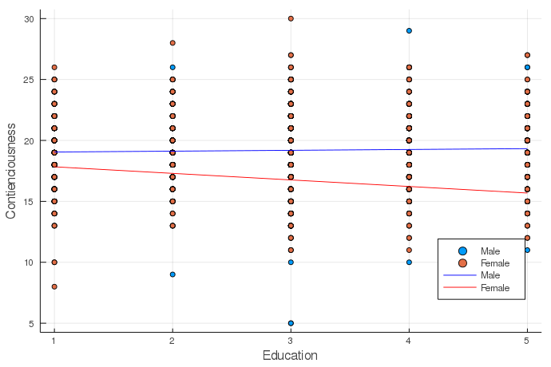

# Setup

Before we start, I encourage you to uncomment the codes below and install the 
required packages that you do not have for this tutorial. 

```julia
using Plots, StatsPlots
#= uncomment below to install packages
using Pkg
Pkg.add(["RDatasets", "Pipe", "DataFrames", "GLM",
        "Plots", "StatPlots"])
=#
```


Prior to running regression analyses, let me briefly go over three essential packages, 
`Pipe`, `RDatasets`, `DataFrames`, in handling data frames in Julia. 


### Brief Introduction to the Package `Pipe`

The package `Pipe` improves the base pipe operator (`|>`) in Julia. It allows
you to represent the object that is piped from with an underscore `_` in the
functions that follow. For example, `sqrt(sum([1, 2, 3]))` involve two commands -- 
one applied to `[1, 2, 3]` and the other one applied to `sum([1, 2, 3])`. We can
pipe these commands, stemming from the `[1, 2, 3]` object, using `@pipe` together
with `|>`, as illustrated below. 

```julia
using Pipe
@pipe [1, 2, 3] |> sum(_) |> sqrt(_)
```

```
2.449489742783178
```


The above code might have overkilled this simple task of taking a sqaure root of a sum, 
but piping will become very useful in handling a long series of commands. 
For more details of `Pipe`, please read the julia tutorial on [pipe]
(https://syl1.gitbook.io/julia-language-a-concise-tutorial/useful-packages/pipe). 

### Brief Introduction to the Package `RDatasets`

The package [`RDatasets`](https://github.com/JuliaStats/RDatasets.jl) 
provides most of the base R datasets for Julia users
to play around. We will be using the dataset `bfi` from the R package `psych`
in this tutorial to explore regression analyses in Julia. 

Let's read in the dataset `bfi` and drop out missing values. 

```julia
using RDatasets
# show(RDatasets.datasets("psych"), allrows=true)
bfi = @pipe dataset("psych", "bfi") |> dropmissing(_)
println(names(bfi))
```

```
["Variable", "A1", "A2", "A3", "A4", "A5", "C1", "C2", "C3", "C4", "C5", "E
1", "E2", "E3", "E4", "E5", "N1", "N2", "N3", "N4", "N5", "O1", "O2", "O3",
 "O4", "O5", "Gender", "Education", "Age"]
```


For a complete R documentation of this dataset, please refer to [this]
(https://www.personality-project.org/r/html/bfi.html). 


### Brief Introduction to the Package `DataFrames`

For simplicity, let's wrangle our data and sum over the scores on the columns 
for agreeableness (`A1` to `A5`) and for contienciousness (`C1` to `C5`). 
`Gender` is a numeric variable in the original dataset, while it should
better be treated as a binary variable. Let's also convert it into a categorical
array using `categorical`. 

`transform()` has similar function as `mutate()` in R, with which we can transform
a column and save it into a new column in a dataframe. The operator `=>` is pretty
intuitive. In the first transform statment down below, we are basically asking Julia to 
take the columns between `A1` and `A5` in `bfi`, transform them by summing scores 
on the same row (`=> ByRow(+)`), and then save these transformed data into a new column 
called `Asum`. 

Note that to call a column in a dataframe, we need to place an colon `:` before
the column name. 

```julia
using DataFrames
bfi = @pipe bfi |> 
            transform(_, Between(:A1, :A5) => ByRow(+) => :Asum) |> 
            transform(_, Between(:C1, :C5) => ByRow(+) => :Csum) |>
            transform(_, :Gender => categorical => :Gender_bin)
describe(select(bfi, Between(:Asum, :Gender_bin)))
```

```
3×7 DataFrame
 Row │ variable    mean     min  median  max  nmissing  eltype             
    ⋯
     │ Symbol      Union…   Any  Union…  Any  Int64     DataType           
    ⋯
─────┼─────────────────────────────────────────────────────────────────────
─────
   1 │ Asum        21.1632  5    22.0    30          0  Int64              
    ⋯
   2 │ Csum        19.0501  5    19.0    30          0  Int64
   3 │ Gender_bin           1            2           0  CategoricalValue{In
t64
                                                                1 column om
itted
```


`describe()` provides summary statistics of the selected columns of our newly 
created variables from `Asum` to `Gender_bin`. As can be seen in the summary
table, `Gender_bin` has a data type of `CategoricalValue{Int64,UInt32}`. 
Through that way in our following regression analysis, gender will be treated as 
a categorical variable and automatically dummy coded. 

For data wrangling in Julia using the package `Dataframes`, a [cheatsheet]
(https://ahsmart.com/assets/pages/data-wrangling-with-data-frames-jl-cheat-sheet/DataFramesCheatSheet_v0.22_rev1.pdf) 
may come in handy here. 
I am a beginner Julia and `Dataframes` user. If you have a better way to
optimize my codes, please let me know and I will be more than happy to learn it!

---

# Linear Regression

Below are some summary statistics and a snapshot of the variables of interest for 
the following analyses.

```julia
describe(select(bfi, Between(:Education, :Gender_bin)))
```

```
5×7 DataFrame
 Row │ variable    mean     min  median  max  nmissing  eltype             
    ⋯
     │ Symbol      Union…   Any  Union…  Any  Int64     DataType           
    ⋯
─────┼─────────────────────────────────────────────────────────────────────
─────
   1 │ Education   3.19141  1    3.0     5           0  Int64              
    ⋯
   2 │ Age         29.5103  3    26.0    86          0  Int64
   3 │ Asum        21.1632  5    22.0    30          0  Int64
   4 │ Csum        19.0501  5    19.0    30          0  Int64
   5 │ Gender_bin           1            2           0  CategoricalValue{In
t64 ⋯
                                                                1 column om
itted
```


```julia
first(select(bfi, Between(:Education, :Gender_bin)), 5)
```

```
5×5 DataFrame
 Row │ Education  Age    Asum   Csum   Gender_bin
     │ Int64      Int64  Int64  Int64  Cat…
─────┼────────────────────────────────────────────
   1 │         3     21     28     22  2
   2 │         2     19     14     15  1
   3 │         1     21     24     17  1
   4 │         1     17     14     19  1
   5 │         5     68     23     18  1
```


In our sample, do older people tend to be more agreeable than younger people?
We can fit a linear model with `Age` as the predictor and `Asum`, the sum scores
of agreeableness, as the outcome variable, and determine whether there is a 
positive association between these two variables. 

The package [`GLM`](https://juliastats.org/GLM.jl/stable/) provides convenient 
ways that are analogous to the R functions `lm()` and `glm()` to specify linear 
models in Julia. 

To build a linear model, we use `lm()`, specify the model equation within
`@formula()`, and indicate the dataset after the formula. 

```julia
using GLM
lm1 = lm(@formula(Asum ~ Age), bfi)
```

```
StatsModels.TableRegressionModel{GLM.LinearModel{GLM.LmResp{Array{Float64,1
}},GLM.DensePredChol{Float64,LinearAlgebra.Cholesky{Float64,Array{Float64,2
}}}},Array{Float64,2}}

Asum ~ 1 + Age

Coefficients:
───────────────────────────────────────────────────────────────────────────
                  Coef.  Std. Error      t  Pr(>|t|)  Lower 95%   Upper 95%
───────────────────────────────────────────────────────────────────────────
(Intercept)  20.4382     0.225823    90.51    <1e-99  19.9954    20.8811
Age           0.0245685  0.00719702   3.41    0.0007   0.010455   0.0386821
───────────────────────────────────────────────────────────────────────────
```


Unlike R, we do not need to additionally summarize `lm1` to get a summary table
of the outputs. 

Equivalent to `lm()`, we can use the `fit()` function with the `LinearModel` argument. 

```julia
fit1 = fit(LinearModel, @formula(Asum ~ Age), bfi)
```

```
StatsModels.TableRegressionModel{GLM.LinearModel{GLM.LmResp{Array{Float64,1
}},GLM.DensePredChol{Float64,LinearAlgebra.Cholesky{Float64,Array{Float64,2
}}}},Array{Float64,2}}

Asum ~ 1 + Age

Coefficients:
───────────────────────────────────────────────────────────────────────────
                  Coef.  Std. Error      t  Pr(>|t|)  Lower 95%   Upper 95%
───────────────────────────────────────────────────────────────────────────
(Intercept)  20.4382     0.225823    90.51    <1e-99  19.9954    20.8811
Age           0.0245685  0.00719702   3.41    0.0007   0.010455   0.0386821
───────────────────────────────────────────────────────────────────────────
```


`lm(...)` and `fit(LinearModel, ...)` do not differ in their 
type, output, and functionality. A quick check on their type:

```julia
typeof(lm1)
```

```
StatsModels.TableRegressionModel{GLM.LinearModel{GLM.LmResp{Array{Float64,1
}},GLM.DensePredChol{Float64,LinearAlgebra.Cholesky{Float64,Array{Float64,2
}}}},Array{Float64,2}}
```


```julia
typeof(fit1)
```

```
StatsModels.TableRegressionModel{GLM.LinearModel{GLM.LmResp{Array{Float64,1
}},GLM.DensePredChol{Float64,LinearAlgebra.Cholesky{Float64,Array{Float64,2
}}}},Array{Float64,2}}
```


which are essentially the same. 

## Extracting Model Information

We can use `coef()`, `stderror()`, and `vcov()` to extract coefficient estimates and 
standard errors of the coefficents, and the estimated variance-covariance matrix
of the coefficient estimates, respectively. 

```julia
coef(lm1)
```

```
2-element Array{Float64,1}:
 20.43821402633636
  0.024568514618654096
```


```julia
stderror(lm1)
```

```
2-element Array{Float64,1}:
 0.22582269777999403
 0.007197020298763872
```


```julia
vcov(lm1)
```

```
2×2 Array{Float64,2}:
  0.0509959   -0.00152855
 -0.00152855   5.17971e-5
```


To obtain statistics for model fit, we can use `r2` for ``R^2`` and
`deviance()` for the weighted residual sum of squares. 

```julia
r2(lm1)
```

```
0.005189310057134855
```


```julia
deviance(lm1)
```

```
29411.99403563621
```


`predict()` computes the predicted values of each individual in our sample. 

```julia
predict(lm1)
```

```
2236-element Array{Float64,1}:
 20.9541528333281
 20.905015804090787
 20.9541528333281
 20.85587877485348
 22.10887302040484
 21.10156392104002
 20.880447289472134
 20.92958431870944
 21.69120827188772
 21.248975008751945
  ⋮
 21.15070095027733
 21.248975008751945
 21.003289862565406
 20.978721347946752
 20.978721347946752
 21.02785837718406
 21.15070095027733
 21.199837979514637
 21.666639757269067
```


!!! note "Follow-up Practice (1)"
Let's try to run a linear model to investigate whether contiouenciousness 
is predicted by education. How much variance is explained by this model?

---

# Multiple Regression

We may suspect that the difference in agreeableness over years of age depend on
someone's education level. To investigate this, we can add an interation between 
`Age` and `Education` on `Asum` by `Age & Education`. Typically when we add an 
interaction term to a model, we include also the main effects of the variables. 
A shorthand of specifying both the main effects and interaction between the 
variables is `Age * Education`. 

```julia
# the models below are equivalent
lm(@formula(Asum ~ Age + Education + Age & Education), bfi)
```

```
StatsModels.TableRegressionModel{GLM.LinearModel{GLM.LmResp{Array{Float64,1
}},GLM.DensePredChol{Float64,LinearAlgebra.Cholesky{Float64,Array{Float64,2
}}}},Array{Float64,2}}

Asum ~ 1 + Age + Education + Age & Education

Coefficients:
───────────────────────────────────────────────────────────────────────────
──────
                      Coef.  Std. Error      t  Pr(>|t|)   Lower 95%    Upp
er 95%
───────────────────────────────────────────────────────────────────────────
──────
(Intercept)      19.4241      0.651563   29.81    <1e-99  18.1463     20.70
18
Age               0.0831532   0.0211002   3.94    <1e-4    0.0417752   0.12
4531
Education         0.273547    0.200684    1.36    0.1730  -0.119999    0.66
7093
Age & Education  -0.016346    0.0061294  -2.67    0.0077  -0.0283659  -0.00
432607
───────────────────────────────────────────────────────────────────────────
──────
```


```julia
lm(@formula(Asum ~ Age * Education), bfi)
```

```
StatsModels.TableRegressionModel{GLM.LinearModel{GLM.LmResp{Array{Float64,1
}},GLM.DensePredChol{Float64,LinearAlgebra.Cholesky{Float64,Array{Float64,2
}}}},Array{Float64,2}}

Asum ~ 1 + Age + Education + Age & Education

Coefficients:
───────────────────────────────────────────────────────────────────────────
──────
                      Coef.  Std. Error      t  Pr(>|t|)   Lower 95%    Upp
er 95%
───────────────────────────────────────────────────────────────────────────
──────
(Intercept)      19.4241      0.651563   29.81    <1e-99  18.1463     20.70
18
Age               0.0831532   0.0211002   3.94    <1e-4    0.0417752   0.12
4531
Education         0.273547    0.200684    1.36    0.1730  -0.119999    0.66
7093
Age & Education  -0.016346    0.0061294  -2.67    0.0077  -0.0283659  -0.00
432607
───────────────────────────────────────────────────────────────────────────
──────
```


!!! note "Follow-up Practice (2)"
Let's fit a model to explore whether there is an interaction between education
and gender (`Gender_bin`) on contienciousness. How much did the variance explained by 
the model increasecompared to the model without the interaction (in reference 
to Practice (1)) increase?  

---

# Probit Regression

For the illustrative purpose, I arbitrarily define that a sum score above 20 out of 25
is a high score of agreeableness and dichotomize `Asum` to 1 or 0 accordingly. 

```julia
bfi = @pipe transform(bfi, 
                      :Asum => ByRow(function(x) 
                                        if x >= 20 1 
                                        else 0 
                                        end 
                                     end) 
                               => :Abin);
describe(select(bfi, :Abin))
```

```
1×7 DataFrame
 Row │ variable  mean     min    median   max    nmissing  eltype
     │ Symbol    Float64  Int64  Float64  Int64  Int64     DataType
─────┼──────────────────────────────────────────────────────────────
   1 │ Abin      0.70975      0      1.0      1         0  Int64
```


Now because our outcome variable is a binary variable, it is more appropriate
to model it with a binomial distribution and a probit link. 

```julia
lm_probit = glm(@formula(Abin ~ Age), bfi, Binomial(), ProbitLink())
```

```
StatsModels.TableRegressionModel{GLM.GeneralizedLinearModel{GLM.GlmResp{Arr
ay{Float64,1},Distributions.Binomial{Float64},GLM.ProbitLink},GLM.DensePred
Chol{Float64,LinearAlgebra.Cholesky{Float64,Array{Float64,2}}}},Array{Float
64,2}}

Abin ~ 1 + Age

Coefficients:
──────────────────────────────────────────────────────────────────────────
                  Coef.  Std. Error     z  Pr(>|z|)   Lower 95%  Upper 95%
──────────────────────────────────────────────────────────────────────────
(Intercept)  0.319024    0.0832706   3.83    0.0001  0.155816    0.482231
Age          0.00798517  0.00269249  2.97    0.0030  0.00270799  0.0132623
──────────────────────────────────────────────────────────────────────────
```


An equivalent way to specify this probit model is 

```julia
fit(GeneralizedLinearModel, @formula(Abin ~ Age), bfi, Binomial(), ProbitLink())
```

```
StatsModels.TableRegressionModel{GLM.GeneralizedLinearModel{GLM.GlmResp{Arr
ay{Float64,1},Distributions.Binomial{Float64},GLM.ProbitLink},GLM.DensePred
Chol{Float64,LinearAlgebra.Cholesky{Float64,Array{Float64,2}}}},Array{Float
64,2}}

Abin ~ 1 + Age

Coefficients:
──────────────────────────────────────────────────────────────────────────
                  Coef.  Std. Error     z  Pr(>|z|)   Lower 95%  Upper 95%
──────────────────────────────────────────────────────────────────────────
(Intercept)  0.319024    0.0832706   3.83    0.0001  0.155816    0.482231
Age          0.00798517  0.00269249  2.97    0.0030  0.00270799  0.0132623
──────────────────────────────────────────────────────────────────────────
```


Our probit model is as follows. 
$$
\Phi^{-1}(\text{High_Agreeableness}) = 0.319 + 0.008 \text{Age}
$$

For a person of age 20, the predicted probit of scoring high on agreeableness is
0.479. 

Note that the coefficients are probability z-scores and the prediction is
a probit. To translate a probit back to a probability, we could use `cdf()` in the 
`Distributions` package. 

`Normal()` by default specifies a normal distribution with a mean of 0 and a standard 
deviation of 1. 

```julia
using Distributions
cdf(Normal(), .479)
```

```
0.6840306856730872
```


The predicted probability of someone at age 20 scoring high on agreeablness is 68.4%. 

---

# Logistic Regression

An alternative way to handle binary outcome variables is through logistic regression. 

```julia
lm_logit = glm(@formula(Abin ~ Age), bfi, Binomial(), LogitLink())
```

```
StatsModels.TableRegressionModel{GLM.GeneralizedLinearModel{GLM.GlmResp{Arr
ay{Float64,1},Distributions.Binomial{Float64},GLM.LogitLink},GLM.DensePredC
hol{Float64,LinearAlgebra.Cholesky{Float64,Array{Float64,2}}}},Array{Float6
4,2}}

Abin ~ 1 + Age

Coefficients:
─────────────────────────────────────────────────────────────────────────
                 Coef.  Std. Error     z  Pr(>|z|)   Lower 95%  Upper 95%
─────────────────────────────────────────────────────────────────────────
(Intercept)  0.497558   0.139339    3.57    0.0004  0.224458    0.770657
Age          0.0135925  0.00455195  2.99    0.0028  0.00467084  0.0225141
─────────────────────────────────────────────────────────────────────────
```


Similarly, an equivalent way to specify this logistic model is 

```julia
fit(GeneralizedLinearModel, @formula(Abin ~ Age), bfi, Binomial(), LogitLink())
```

```
StatsModels.TableRegressionModel{GLM.GeneralizedLinearModel{GLM.GlmResp{Arr
ay{Float64,1},Distributions.Binomial{Float64},GLM.LogitLink},GLM.DensePredC
hol{Float64,LinearAlgebra.Cholesky{Float64,Array{Float64,2}}}},Array{Float6
4,2}}

Abin ~ 1 + Age

Coefficients:
─────────────────────────────────────────────────────────────────────────
                 Coef.  Std. Error     z  Pr(>|z|)   Lower 95%  Upper 95%
─────────────────────────────────────────────────────────────────────────
(Intercept)  0.497558   0.139339    3.57    0.0004  0.224458    0.770657
Age          0.0135925  0.00455195  2.99    0.0028  0.00467084  0.0225141
─────────────────────────────────────────────────────────────────────────
```


Now our logistic model is as follows. 
$$
logit(\text{High_Agreeableness}) = 0.498 + 0.014 \text{Age}
$$

For a person of age 20, the predicted logit of scoring high on agreeableness is
0.778. Now the prediction is represented in terms of logit. To make it more interpretable, 
we can simply exponentiate the logit to get the odds ratio, or use the following formula
to get the probability:

$$
\hat{\pi} = \frac{exp(0.498 + 0.014)}{1 + exp(0.498 + 0.014)}
$$

where ``\hat{\pi}`` is the predicted probability of someone scoring high on agreeableness. 

```julia
exp(.778)/(1 + exp(.778))
```

```
0.6852489081587367
```


Consistent with the result from probit regression, the predicted probability of someone 
at age 20 scoring high on agreeablness is 68.5%. 

---

# Visualization

Let's cover the answers of Follow-up Practice (1) and (2) here. 

```julia
# Practice (1)
lm3 = fit(LinearModel, @formula(Csum ~ Education), bfi)
```

```
StatsModels.TableRegressionModel{GLM.LinearModel{GLM.LmResp{Array{Float64,1
}},GLM.DensePredChol{Float64,LinearAlgebra.Cholesky{Float64,Array{Float64,2
}}}},Array{Float64,2}}

Csum ~ 1 + Education

Coefficients:
──────────────────────────────────────────────────────────────────────────
                Coef.  Std. Error       t  Pr(>|t|)   Lower 95%  Upper 95%
──────────────────────────────────────────────────────────────────────────
(Intercept)  18.5942    0.176512   105.34    <1e-99  18.2481     18.9403
Education     0.14285   0.0522318    2.73    0.0063   0.0404219   0.245278
──────────────────────────────────────────────────────────────────────────
```


```julia
# Practice (2)
lm4 = fit(LinearModel, @formula(Csum ~ Education*Gender_bin), bfi)
```

```
StatsModels.TableRegressionModel{GLM.LinearModel{GLM.LmResp{Array{Float64,1
}},GLM.DensePredChol{Float64,LinearAlgebra.Cholesky{Float64,Array{Float64,2
}}}},Array{Float64,2}}

Csum ~ 1 + Education + Gender_bin + Education & Gender_bin

Coefficients:
───────────────────────────────────────────────────────────────────────────
──────────────
                                Coef.  Std. Error      t  Pr(>|t|)   Lower 
95%  Upper 95%
───────────────────────────────────────────────────────────────────────────
──────────────
(Intercept)                18.9793      0.287144   66.10    <1e-99  18.4162
     19.5424
Education                   0.0693464   0.0844421   0.82    0.4116  -0.0962
469   0.23494
Gender_bin: 2              -0.607298    0.364028   -1.67    0.0954  -1.3211
7     0.106571
Education & Gender_bin: 2   0.119855    0.10743     1.12    0.2647  -0.0908
195   0.330529
───────────────────────────────────────────────────────────────────────────
──────────────
```


Note that `Gender_bin` is dummy coded with male (1) as 0 and female (2) as 1. 
The default in `GLM` is dummy coding, but we can specify a different 
contrast coding. More details on contrast coding can be found [here]
(https://juliastats.org/StatsModels.jl/stable/contrasts/).  

```julia
# extracting coefficients
lm3_b0, lm3_b1 = coef(lm3);
lm4_b0, lm4_b1, lm4_b2, lm4_b3 = coef(lm4);
```


We will use the package [`Plots`](http://docs.juliaplots.org/latest/)
for visualizing the relationship between variables in the fitted models. 
The package [`StatsPlots`](http://docs.juliaplots.org/latest/contributing/#StatsPlots) 
is an extension of `Plots` that supports plotting with `DataFrame` objects. 

```julia
@df bfi scatter(
    :Education, 
    :Csum, 
    group = :Gender, 
    legend = :bottomright, 
    label = ["Male" "Female"], 
    xlabel = "Education", 
    ylabel = "Contientiousness") 
plot!((x) -> lm3_b0 + lm3_b1 * x, 1, 5, label = "Linear Model")
```


```julia
@df bfi scatter(
    :Education, 
    :Csum, 
    group = :Gender, 
    legend = :bottomright, 
    label = ["Male" "Female"], 
    xlabel = "Education", 
    ylabel = "Contienciousness", 
    size=(690,460)) 
plot!((x) -> lm4_b0 + lm4_b1 * x + lm4_b2 * 0 + lm4_b2 * x * 0, 
      1, 5, label = "Male", linecolor = "blue")
plot!((x) -> lm4_b0 + lm4_b1 * x + lm4_b2 * 1 + lm4_b2 * x * 1, 
      1, 5, label = "Female", linecolor = "red")
```




I also made reference to this [webpage](https://nextjournal.com/DeepLearningNotes/Ch03LinearRegression)
to create the plots above. 

Perhaps because the "research questions" I posed here were not so interesting, 
there was not much interesting to observe from the analysis outputs and the
plots. But I hope you enjoy this tutorial in doing regression analyses with Julia :)