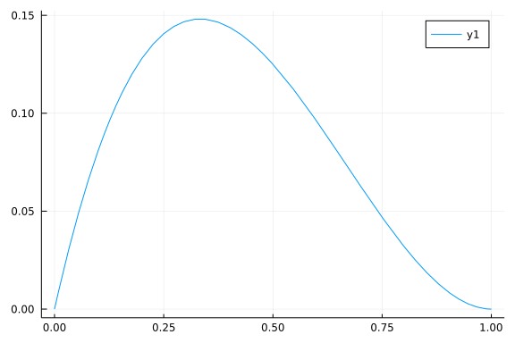
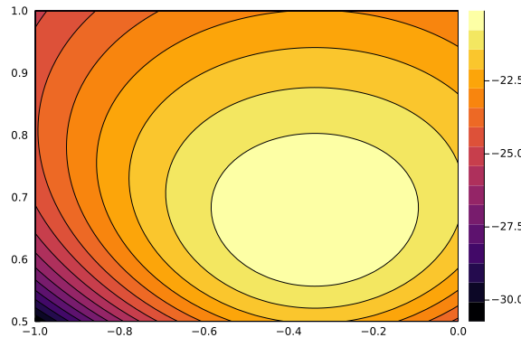

For a statistical model of data $\mathbf{y}$ written as $f(\mathbf{y}; \boldsymbol{\mathbf{\theta}})$ with parameters $\boldsymbol{\mathbf{\theta}}$, the likelihood function, $\mathcal{L}(\boldsymbol{\mathbf{\theta}}; \mathbf{y})$, is the probability of the data given the parameter values. 

## Loading Packages

```julia
using Plots, Distributions, Random
using Optim
using NLSolversBase, ForwardDiff, FiniteDifferences
using HypothesisTests
using Printf
using LinearAlgebra
```


# Simple Bernoulli Example

As a simple example, consider a model where $Y$ is assumed to follow a Bernoulli distribution with probability of success equals $\theta$. Assume that there are three observed values $\mathbf{y} = [0, 1, 0]'$. You can think about flipping a coin (which may or may not be fair) three times, and call it a success if the coin shows a head. The model further assumes that each coin flip is independent. Therefore, if the success probability is $\theta$, then the probability of observing $\mathbf{y} = [0, 1, 0]'$ is
$$\mathcal{L}(\theta; y_1 = 0, y_2 = 1, y_3 = 0) = (1 - \theta) \times \theta \times (1 - \theta) = \theta(1 - \theta)^2,$$
which is our likelihood function. Note that $\theta \in [0, 1]$ We can write the function in Julia

```julia
# Note that it returns zero when theta is out of range
lik(θ) = (0 <= θ <= 1) ? θ * (1 - θ)^2 : 0
# Try theta = 0.5
lik(0.5)
# Try theta = 0.3
lik(0.3)
# Try theta = -0.1
lik(-0.1)
```

```
0
```


We can plot the likelihood function [need help to annotate it]

```julia
plot(lik, 0, 1)
```




The maximum point of the curve is the maximum likelihood estimate (MLE), usually denoted as $\hat \theta$. From eyeballing we can see $\hat \theta \approx 1 / 3$. As you probably can guess, the MLE is the sample mean. 

## Grid Search

Let's write a Julia program to find the MLE. One brute force method is to try discrete values, say 0, 0.001, 0.002, up to 1:

```julia
# Write a function that returns the maximum likelihood value and the estimate
# Need to make the lower bound, the upper bound, and the grid size as parameters
my_find_mle = function(lik, grid_size)
    thetas = 0:grid_size:1
    lik_vals = [lik(i) for i in thetas]
    max_lik, max_idx = findmax(lik_vals)
    return (lik = max_lik, mle = thetas[max_idx])
end
my_find_mle(lik, .00001)
```

```
(lik = 0.148148148137037, mle = 0.33333)
```


## Gradient Descent/Ascent

An algorithm to minimize a function $f$ is to iteratively do
$$\theta_{s + 1} = \theta_s + \gamma f'(\theta_s),$$
where $\gamma$ is a step size/learning rate. We need to first to find the derivative. It can be done numerically, like

```julia
lik_prime(θ; h = 1e-5) = (lik(θ + h) - lik(θ)) / h
# lik_prime(0.5)
```

```
lik_prime (generic function with 1 method)
```


> Note: One can also use the [central difference](https://en.wikipedia.org/wiki/Finite_difference#Basic_types) method, which is more accurate

```julia
step_size = 0.6
θ₀ = 0.5
lik0 = lik(θ₀)
del0 = lik_prime(θ₀)
θ₁ = θ₀ + step_size * del0
del1 = lik_prime(θ₁)
θ₂ = θ₁ + step_size * del1
# TODO: Write a loop/function to find the MLE
function ga(f, θ; step_size = 0.6, tol = 1e-10, max_iter = 100)
    f_prime(θ; h = 1e-5) = (f(θ + h) - f(θ)) / h
    del = f_prime(θ)
    iter = 0
    while (iter < max_iter && abs(del) > tol)
        θ += step_size * del
        del = f_prime(θ)
        iter += 1
    end
    println("converged after ", iter, " iterations.")
    θ
end
```

```
ga (generic function with 1 method)
```


### Log-Likelihood

The log-likelihood function is 
$$\ell(\theta; y_1 = 0, y_2 = 1, y_3 = 0) = \log \theta + 2 \log(1 - \theta).$$

The second derivative (or Hessian if $\theta$ is a vector), is useful to obtaining approximate standard errors for the estimate. From the theory of maximum likelihood estimation, it can be shown that the standard error of the MLE is approximately $\sqrt{- 1 / \ell''(\theta)}$. This is usually called the asymptotic standard error, or ase. 

```julia
ll(θ) = log(lik(θ))
# Numerical first derivative
ll_prime(θ; h = 1e-5) = (ll(θ + h) - ll(θ)) / h
# Numerical second-order derivative (2nd order forward)
ll_prime2(θ; h = 1e-5) = (ll(θ + 2h) - 2ll(θ + h) + ll(θ)) / h^2
# Asymptotic standard error
ase(θ) = sqrt(- 1 / ll_prime2(θ))
```

```
ase (generic function with 1 method)
```


So the ase is 0.27. 

## Newton's Method

See https://en.wikipedia.org/wiki/Newton%27s_method_in_optimization

```julia
θ₀ = 0.5
ll0 = ll(θ₀)
del0 = ll_prime(θ₀)
deldel0 = ll_prime2(θ₀)
θ₁ = θ₀ - del0 / deldel0
del1 = ll_prime(θ₁)
deldel1 = ll_prime2(θ₁)
θ₂ = θ₁ + del1 / deldel1
# TODO: Write a loop/function to find the MLE (credit to Winnie Tse)
function newt(θ; step_size = .6, tol = 1e-10, max_iter = 10)
    del = ll_prime(θ)
    deldel = ll_prime2(θ)
    iter = 0
    while (iter < max_iter && abs(del) > tol)
        θ += (-1)^(iter+1) * del / deldel
        del = ll_prime(θ)
        deldel = ll_prime2(θ)
        iter += 1
    end
    println("converged after ", iter, " iterations.")
    θ
end
newt(.5)
```

```
converged after 5 iterations.
0.33332833334790385
```


## Using Established Algorithms with `Optim.jl`

See https://julianlsolvers.github.io/Optim.jl/stable/

```julia
# Find minimum on -LL
opt = optimize(x -> -ll(x), 0, 1)  # Brent's Method
# Second-derivative (5th order central method)
FiniteDifferences.central_fdm(5, 2)(ll, opt.minimizer)
```

```
-13.499999822735278
```


## Fit MLE

```julia
# From Distributions.jl
fit_mle(Bernoulli, [0, 1, 0])
```

```
Distributions.Bernoulli{Float64}(p=0.3333333333333333)
```


# Regression

$$Y = \beta_0 + \beta_1 X + e$$

$$e \sim N(0, \sigma)$$

$$f(Y; \beta_0, \beta_1) \overset{d}{=} N(\beta_0 + \beta_1 X, \sigma)$$

$$f(Y_1, Y_2, \ldots; \beta_0, \beta_1) \overset{d}{=} \Pi_{i = 1}^n N(\beta_0 + \beta_1 X_i, \sigma)$$

$$\ell(\beta_0, \beta_1, \sigma; y_1, y_2, \ldots, y_n) = \sum_{i = 1}^n \ell(\beta_0, \beta_1, \sigma; y_i)$$

$$\ell(\beta_0, \beta_1, \sigma; y_1, y_2, \ldots, y_n) =  -\frac{n}{2} \log(2 \pi) - n \log \sigma - \frac{\sum_{i = 1}^n(y_i - \beta_0 - \beta_1 x_i)^2}{2 \sigma^2}$$

<!--

$$f(x) = \frac{1}{\sqrt{2 \pi} \sigma} \exp\left[-\frac{(x - \mu)^2}{2 \sigma^2}\right]$$
for $X \sim N(\mu, \sigma)$
$$
  \begin{aligned}
  \log f(x) & = -\log(\sqrt{2\pi} \sigma) + \left[-\frac{(x - \mu)^2}{2 \sigma^2}\right]  \\
  & = -\frac{1}{2} \log(2 \pi) - \log \sigma -\frac{(x - \mu)^2}{2 \sigma^2} \\
  \end{aligned}
$$

-->

## Sample Data

```julia
# From the `lm()` example in R
ctl = [4.17, 5.58, 5.18, 6.11, 4.50, 4.61, 5.17, 4.53, 5.33, 5.14]
trt = [4.81, 4.17, 4.41, 3.59, 5.87, 3.83, 6.03, 4.89, 4.32, 4.69]
```


```julia
# Likelihood function
function ll(θ; yc = ctl, yt = trt)
    σ = θ[3]
    if σ < 0 
        return -Inf
    end
    β₀ = θ[1]
    β₁ = θ[2]
    sum(vcat(logpdf(Normal(β₀, σ), yc), 
             logpdf(Normal(β₀ + β₁, σ), yt)))
end
```

```
ll (generic function with 1 method)
```


Plot the conditional log-likelihood functions

```julia
# Just beta1
plot(x -> ll([5, x, 1]), -2, 2)
# Both beta1 and sigma
contour(-1:0.01:0, 0.5:0.01:1, (x, y) -> ll([5, x, y]), fill = true)
```




### With `Optim.jl`

```julia
opt = optimize(x -> -ll(x), [4.0, 1.0, 1.0])    # Nelder-Mead
opt.minimizer
```

```
3-element Vector{Float64}:
  5.03198824016666
 -0.37098861906446434
  0.6606616771567159
```


Or use `Optim.maximize`

```julia
result = maximize(ll, [4.0, 1.0, 1.0])
result.res.minimizer
```

```
3-element Vector{Float64}:
  5.03198824016666
 -0.37098861906446434
  0.6606616771567159
```


#### Box Constraints

When some of the parameter(s) are constrained in just a subset of the real line. 

```julia
function ll2(θ; yc = ctl, yt = trt)
    sum(vcat(logpdf(Normal(θ[1], θ[3]), yc), 
             logpdf(Normal(θ[1] + θ[2], θ[3]), yt)))
end
# Unconstrained for beta, [0, infinity) for sigma
opt_box = optimize(x -> -ll2(x), 
                   [-Inf, -Inf, 0], [Inf, Inf, Inf], 
                   [4.0, 1.0, 1.0])    # Fminbox with L-BFGS
opt_box.minimizer
```

```
3-element Vector{Float64}:
  5.032000000048675
 -0.3710000000898218
  0.6606530860112547
```


To obtain the Hessian (to be used to compute standard errors, use

```julia
hess = ForwardDiff.hessian(x -> ll(x), opt.minimizer)
# Asymptotic covariance matrix
- inv(hess)
```

```
3×3 Matrix{Float64}:
  0.0436474   -0.0436474   -3.88479e-7
 -0.0436474    0.0872948    3.75962e-7
 -3.88479e-7   3.75962e-7   0.0109123
```


Compare to $t$ test

```julia
EqualVarianceTTest(ctl, trt)
```

```
Two sample t-test (equal variance)
----------------------------------
Population details:
    parameter of interest:   Mean difference
    value under h_0:         0
    point estimate:          0.371
    95% confidence interval: (-0.2833, 1.0253)

Test summary:
    outcome with 95% confidence: fail to reject h_0
    two-sided p-value:           0.2490

Details:
    number of observations:   [10,10]
    t-statistic:              1.191260381848704
    degrees of freedom:       18
    empirical standard error: 0.3114348514002032
```


#### With Analytic Derivatives

```julia
function g!(G, θ; yc = ctl, yt = trt)
    n = size(ctl, 1) + size(trt, 1)
    G[1] = - (sum(yc .- θ[1]) + sum(yt .- θ[1] .- θ[2])) / θ[3]^2
    G[2] = - sum(yt .- θ[1] .- θ[2]) / θ[3]^2
    G[3] = n / θ[3] - sum(vcat(yc .- θ[1], yt .- θ[1] .- θ[2]) .^ 2) / θ[3]^3
end
```

```
g! (generic function with 1 method)
```


```julia
opt2 = optimize(x -> -ll(x), g!, [4.0, 1.0, 1.0], GradientDescent())
```

```
* Status: success

 * Candidate solution
    Final objective value:     2.008824e+01

 * Found with
    Algorithm:     Gradient Descent

 * Convergence measures
    |x - x'|               = 1.92e-09 ≰ 0.0e+00
    |x - x'|/|x'|          = 3.82e-10 ≰ 0.0e+00
    |f(x) - f(x')|         = 0.00e+00 ≤ 0.0e+00
    |f(x) - f(x')|/|f(x')| = 0.00e+00 ≤ 0.0e+00
    |g(x)|                 = 6.96e-08 ≰ 1.0e-08

 * Work counters
    Seconds run:   0  (vs limit Inf)
    Iterations:    88
    f(x) calls:    224
    ∇f(x) calls:   224
```


#### With Automatic Differentiation (AD)

```julia
obj_func = TwiceDifferentiable(x -> -ll(x), [4.0, 1.0, 1.0]; 
                               autodiff = :forward)
opt3 = optimize(obj_func, [4.0, 1.0, 1.0])  # Newton's method
NLSolversBase.hessian!(obj_func, opt3.minimizer)
```

```
3×3 Matrix{Float64}:
 45.823        22.9115       -3.52496e-14
 22.9115       22.9115       -3.34732e-14
 -3.52496e-14  -3.34732e-14  91.6459
```


### Using `JuMP.jl`

```julia
using JuMP
import Ipopt
model = Model(Ipopt.Optimizer)
@variable(model, β[1:2])
setvalue(β[1], 4.0)
setvalue(β[2], 1.0)
@variable(model, σ >= 0.0, start = 1.0)
@NLobjective(
    model,
    Max,
    -10 * log(σ) - sum((ctl[i] - β[1])^2 for i = 1:10) / (2 * σ^2) + 
    -10 * log(σ) - sum((trt[i] - β[1] - β[2])^2 for i = 1:10) / (2 * σ^2)
)
# @NLconstraint(model, β₀ == 10σ)
optimize!(model)
JuMP.value.(β)
JuMP.value.(σ)
```

```
***************************************************************************
***
This program contains Ipopt, a library for large-scale nonlinear optimizati
on.
 Ipopt is released as open source code under the Eclipse Public License (EP
L).
         For more information visit https://github.com/coin-or/Ipopt
***************************************************************************
***

This is Ipopt version 3.13.4, running with linear solver mumps.
NOTE: Other linear solvers might be more efficient (see Ipopt documentation
).

Number of nonzeros in equality constraint Jacobian...:        0
Number of nonzeros in inequality constraint Jacobian.:        0
Number of nonzeros in Lagrangian Hessian.............:        6

Total number of variables............................:        3
                     variables with only lower bounds:        1
                variables with lower and upper bounds:        0
                     variables with only upper bounds:        0
Total number of equality constraints.................:        0
Total number of inequality constraints...............:        0
        inequality constraints with only lower bounds:        0
   inequality constraints with lower and upper bounds:        0
        inequality constraints with only upper bounds:        0

iter    objective    inf_pr   inf_du lg(mu)  ||d||  lg(rg) alpha_du alpha_p
r  ls
   0 -1.0264350e+01 0.00e+00 6.93e+00  -1.0 0.00e+00    -  0.00e+00 0.00e+0
0   0
   1 -3.6504365e+00 0.00e+00 3.23e+01  -1.0 7.91e+00   0.0 1.00e+00 1.55e-0
1f  2
   2 -2.0124548e+00 0.00e+00 8.88e+00  -1.0 9.54e-02    -  8.95e-01 1.00e+0
0f  1
   3 -1.7225159e+00 0.00e+00 1.75e+00  -1.0 5.56e-02    -  1.00e+00 1.00e+0
0f  1
   4 -1.7094835e+00 0.00e+00 1.07e-01  -1.0 1.67e-02    -  1.00e+00 1.00e+0
0f  1
   5 -1.7094719e+00 0.00e+00 6.82e-05  -2.5 4.64e-04    -  1.00e+00 1.00e+0
0f  1
   6 -1.7094718e+00 0.00e+00 6.89e-07  -3.8 4.45e-05    -  1.00e+00 1.00e+0
0f  1
   7 -1.7094718e+00 0.00e+00 2.10e-09  -5.7 2.45e-06    -  1.00e+00 1.00e+0
0f  1
   8 -1.7094718e+00 0.00e+00 3.50e-13  -8.6 3.04e-08    -  1.00e+00 1.00e+0
0f  1

Number of Iterations....: 8

                                   (scaled)                 (unscaled)
Objective...............:   1.7094718195406751e+00   -1.7094718195406751e+0
0
Dual infeasibility......:   3.4991254363551114e-13    3.4991254363551114e-1
3
Constraint violation....:   0.0000000000000000e+00    0.0000000000000000e+0
0
Complementarity.........:   2.5059884083328424e-09   -2.5059884083328424e-0
9
Overall NLP error.......:   2.5059884083328424e-09    3.4991254363551114e-1
3


Number of objective function evaluations             = 14
Number of objective gradient evaluations             = 9
Number of equality constraint evaluations            = 0
Number of inequality constraint evaluations          = 0
Number of equality constraint Jacobian evaluations   = 0
Number of inequality constraint Jacobian evaluations = 0
Number of Lagrangian Hessian evaluations             = 8
Total CPU secs in IPOPT (w/o function evaluations)   =      2.174
Total CPU secs in NLP function evaluations           =      1.901

EXIT: Optimal Solution Found.
0.6606530860101113
```


For more discussion on these packages and other packages in Julia, this page https://julia.quantecon.org/more_julia/optimization_solver_packages.html would be helpful. Also check out the documentation of [`JuMP.jl`](https://jump.dev/JuMP.jl/stable/) and [`Optim.jl`](https://julianlsolvers.github.io/Optim.jl/stable/). 

### Sufficient Statistics

It can be shown that the likelihood function depends only on $\sum_{i = 1}^n y_i^2$ and $\sum_{i = 1}^n y_i$. This helps speed up the optimization. 

```julia
# Likelihood function with sufficient statistics
function ll_suff(θ; sum_yc = sum(ctl), sum_yt = sum(trt), 
                    sum_ycsq = sum(ctl .^ 2), sum_ytsq = sum(trt .^ 2))
    β₀ = θ[1]
    β₁ = θ[2]
    σ = θ[3]
    μₜ = β₀ + β₁
    - 10 * log(2pi) - 20 * log(σ) - 
    (sum_ycsq + sum_ytsq - 2 * (β₀ * sum_yc + μₜ * sum_yt) + 
     10 * (β₀^2 + μₜ^2)) / 2σ^2
end
# Unconstrained for beta, [0, infinity) for sigma
opt_box = optimize(x -> -ll_suff(x), 
                   [-Inf, -Inf, 0], [Inf, Inf, Inf], 
                   [4.0, 1.0, 1.0])    # Fminbox with L-BFGS
opt_box.minimizer
```

```
3-element Vector{Float64}:
  5.032000000229699
 -0.3710000002832418
  0.6606530859921219
```
