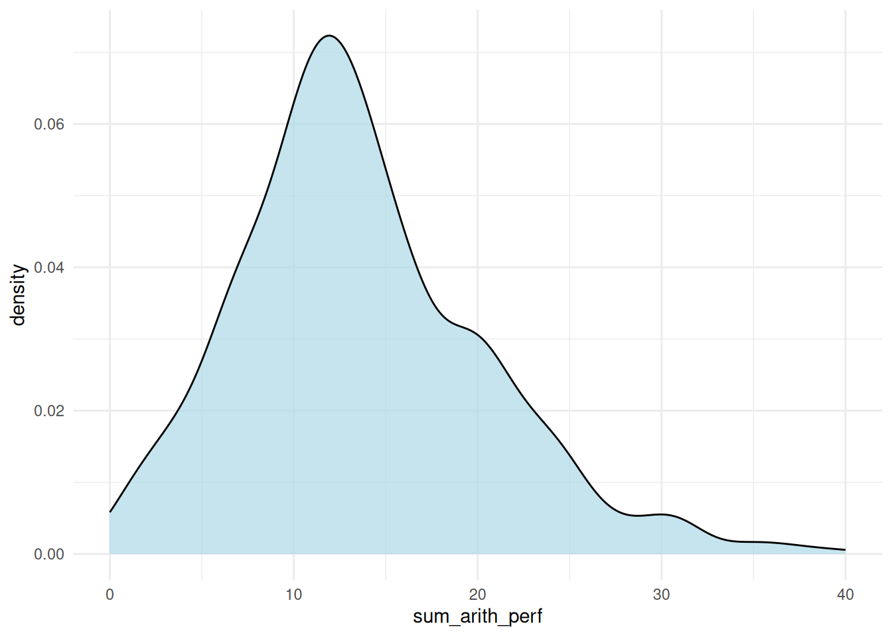
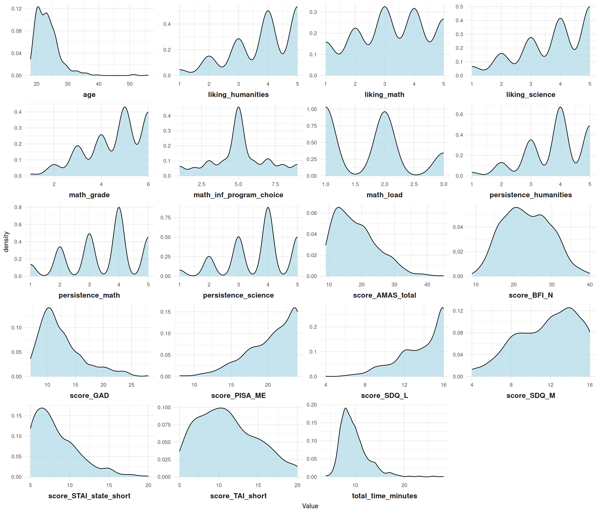
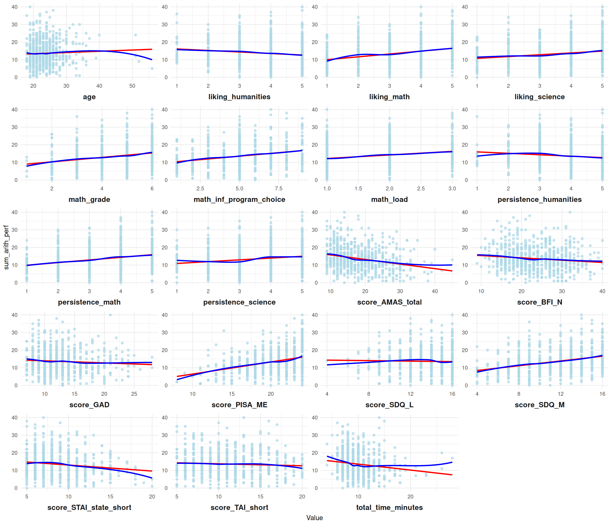

In this document, I will walk through a simple tutorial for fitting and analyzing a random forest model of typical psychological data.

Although the workings of random forest models are explained in depth elsewhere ([click here for a more detailed but digestible explanation](https://einsteinmed.edu/uploadedfiles/centers/ictr/new/intro-to-random-forest.pdf)), to be brief, random forest models are built from single decision trees, which predict a response variable/dependent variable (DV) based on binary answers to other questions, which are selected in order to create as homologous of groups as possible. For example, a tree might first decide to check "Is the social anxiety score over or under 10.5?", and divide the data based on each record's "answer". Then, it will continuously repeat the process with new questions designed to improve the decisions, like "Is sex male or female?", until it has finalized its prediction and new questions do not improve its output. A random forest model is built from averaging the observations of thousands or more trees, all of which ask different "questions" and may assess different variables [@breiman_random_2001].

Random forest models usually do well in describing nonlinear/complex relationships between predictor and response variables, are robust (though can technically overfit), and can handle missing and categorical data. However, they are more difficult to interpret than other models like linear regression. Random forests are popular in fields such as biostatistics because they are excellent for problems where the number of predictors *p* exceeds the number of samples/participants *n*. Such problems are not as common in psychology, but random forests still model *n*\>*p* problems well, as should be expected.  

This is the first part of a set of documents walking through building simple random forest models for psychological data, including the forthcoming addenda `Methods of Variable Selection`, `LASSO (Least absolute shrinkage and selection operator)`, and finally `Predictions`.

All references (including the dataset) are at the end of the document.

## The Task at Hand

Importantly, I am conducting a **regression** task (predicting a continuous variable), not a **classification** task (predicting a dichotomous or polytomous variable).

The **first** main objective I'll be attempting to address, and the **only one addressed in this specific document** (the other tasks are addressed in addendum posts, which I link to at the top and bottom of this document as well as throughout), is that I would like to build a suitable predictive model that generalizes well to unseen data of arithmetic performance score in German students from a set of predictor variables including age, sex, self-reported math anxiety, and others. Testing on unseen data is specifically performed in my `Predictions` addendum.

My **second** main objective is to find a "parsimonious" model, which uses a small number of variables to make "good" or "sufficient" prediction. This may be useful insofar as, for example, future researchers do not have to waste resources collecting unimportant variables for no or minimal improvement in prediction. This can be found in my forthcoming `Methods for Variable Selection` and `LASSO` addenda.

A related **subgoal** is another common objective, that being I would like to have a good sense of which predictor variables appear useful in predicting arithmetic performance and which ones do not. In other words, I would like to identify which variables are important to predicting the response, regardless of their correlation with other predictors. This will also be addressed in my forthcoming `Methods for Variable Selection` and `LASSO` addenda.

I have not seen the data ahead of time. The analyses described hereafter are entirely novel.

## The Data

The dataset I will investigate in this document is from Cipora and colleagues [-@cipora_amatus_2024]. It is characteristic of many psychology datasets --- it has a solid but not too large sample size (735 N before being split into test/training sets), a good but not excessive number of potential predictors (20+ collected as part of the survey, many of which are likely unhelpful in prediction), and what is likely middling to low effect sizes for predictors.

For what it's worth, this dataset does not scream "use random forest". The appeal of random forests is often their proficiency in modeling *p* $\ggg$ *n* situations, particularly because random forest models often do best on sizeable datasets. However, random forest models are able to model many situations, including *n*\>*p*, well and often do so competitively with other models, such as linear regression or other machine learning models. I will find out if this holds for our dataset in my `Prediction` addendum.

For simplicity and didactic purposes, I have pulled twenty variables from the full dataset for my analysis. Some will have a relationship with the DV, others will not. *A priori* variable selection according to expert knowledge of what variables are likely to have predictive relevance would likely be the best variable selection method, though I have retained all suitable variables for this demonstration. Variable selection for this dataset is the focus of my forthcoming `Methods for Variable Selection` addendum.

Below, I define the single DV as well as the twenty candidate predictor variables followed by the syntax for their object in R.

### Dependent Variable Definition

1.  Arithmetic performance/`sum_arith_perf`, as measured by "the number of correctly solved problems in order as instructed" on a simple arithmetic speed test.

### Predictors Definitions

1.  Age/`age`, as measured in years.

2.  Sex/`sex`, where 1 = male, 2 = female, and 3=other. Participants who ignored this question were removed.

3.  Neuroticism/`score_BFI_N`, as measured by the sum score of the 8 items of the Big Five Inventory (short version) pertaining to neuroticism.

4.  Math anxiety/`score_AMAS_total`, as measured by the sum score on the Abbreviated Math Anxiety Scale.

5.  General trait anxiety/`score_GAD`, as measured by sum score on the Generalized Anxiety Disorder Screener (GAD-7).

6.  Math self-efficacy/`score_PISA_ME`, as measured by using the sum score of six items designed by the OECD for a previous study.

7.  General state anxiety/`score_STAI_state_short`, as assessed by the sum of the five-item scale STAI-SKD.

8.  Test anxiety/`score_TAI_short`, as measured by the sum score of the 5 items on the short version of the Test Anxiety Inventory.

9.  Math self-concept/`score_SDQ_M`, as measured by the sum score of the four math-related statements on the Self-Description Questionnaire III. Evaluates variables such as one's comfort/enjoyment/pride with math, whereas self-efficacy evaluates one's self-confidence in math abilities.

10. Language self-concept/`score_SDQ_L`, as measured by the sum score of the four language-related statements on the Self-Description Questionnaire III.

11. Total duration of survey/`total_time_minutes`, as measured by the number of full minutes a participant took to complete the survey (excluding the timed arithmetic performance section).

12. Last math grade at school/`math_grade`, as measured on a scale ranging from 1-6, where 1 is the best grade and 6 is the worst. (I will reverse this in data cleaning)

13. Participant subject's relation to math/`math_load`, where a "1" means a participant's subject of study has low relation to math, a "2" means a participant's subject has medium relation to math, and a "3" means a participant's subject has high relation to math.

14. Influence of math load on participant's subject choice/`math_inf_program_choice`, as measured by a 9-point Likert scale where a "1" means "chosen because I wanted to avoid math subjects", a "5" means "no role" and a "9" means "chosen because I wanted to take math subjects".

15. Level of liking math/`liking_math`, as measured by a 5-point Likert scale where a "1" means "not at all" and a 5 means "absolutely".

16. Level of liking science/`liking_science`, as measured by a 5-point Likert scale where a "1" means "not at all" and a 5 means "absolutely".

17. Level of liking humanities/`liking_humanities`, as measured by a 5-point Likert scale where a "1" means "not at all" and a 5 means "absolutely".

18. Persistence in solving tasks in mathematics/`persistence_math`, as measured by a 5-point Likert scale where a "1" means "I get discouraged very fast" and a "5" means "I am very persistent".

19. Persistence in solving tasks in science/`persistence_science`, as measured by a 5-point Likert scale where a "1" means "I get discouraged very fast" and a "5" means "I am very persistent".

20. Persistence in solving tasks in humanities/`persistence_humanities`, as measured by a 5-point Likert scale where a "1" means "I get discouraged very fast" and a "5" means "I am very persistent".

## Cleaning the Data and a Little Exploratory Data Analysis

I'll start with importing and cleaning the data to make sure it fits the task. I load the most basic libraries - I will load other libraries at the start of later code chunks when needed.
The package required for each function in this document is specified in the function call, unless it is available in base R.


::: {.cell}

```{.r .cell-code}
library(here)
library(tidyverse)
library(readr)
```
:::


The `here()` function is convenient for creating paths and directories that won't break when files are moved or when you reproduce the work on another computer [@muller_here_2020]. More information is available at the following URL: https://here.r-lib.org/

Below, I'll use the `here()` function to tell the `readr()` function where to go to get the dataset. The data was stored in my "Main Script" folder, in a subfolder called "OSF archive", and named "AMATUS_dataset.csv". Notice how I use a `normalizePath()` function to convert relative path names to absolute path names, which helps when switching OSes or from cloud to local storage.


::: {.cell}

```{.r .cell-code}
file_path <- here::here(
  "OSF archive/AMATUS_dataset.csv"
)
# Also adjust this as needed. Function from base R.

# Importing dataset
amatus <- readr::read_csv2(file_path, c("", "NA"), col_names = TRUE)
## ℹ Using "','" as decimal and "'.'" as grouping mark. Use `read_delim()` for more control.
# Note that the `c()` function is defining
# what NA values look like for the import function.

head(amatus)
## # A tibble: 6 × 187
##   id_unique id_sample sample     sex     age age_range native_speaker math_grade
##       <dbl>     <dbl> <chr>      <chr> <dbl> <chr>     <chr>               <dbl>
## 1         1         1 german_st… m        18 < 20 yea… yes                     1
## 2         2         2 german_st… m        24 20-29 ye… yes                     2
## 3         3         3 german_st… m        19 < 20 yea… yes                     3
## 4         4         4 german_st… f        20 20-29 ye… yes                     1
## 5         5         6 german_st… f        19 < 20 yea… yes                     5
## 6         6         8 german_st… f        22 20-29 ye… yes                     3
## # ℹ 179 more variables: math_load <dbl>, math_inf_program_choice <dbl>,
## #   honesty <chr>, breaks <chr>, noise <dbl>, device <chr>,
## #   total_time_minutes <dbl>, liking_math <dbl>, liking_science <dbl>,
## #   liking_humanities <dbl>, persistence_math <dbl>, persistence_science <dbl>,
## #   persistence_humanities <dbl>, score_AMAS_total <dbl>,
## #   score_AMAS_learning <dbl>, score_AMAS_testing <dbl>, AMAS1 <dbl>,
## #   AMAS2 <dbl>, AMAS3 <dbl>, AMAS4 <dbl>, AMAS5 <dbl>, AMAS6 <dbl>, …
# View the data.

amatusclean <- amatus[!is.na(amatus$sum_arith_perf), ]
# Removing the individuals who did not complete the performance test in order
# as instructed. Using simple subsetting.
amatusclean <- amatusclean[!(amatusclean$sample %in%
  c("german_teachers", "belgian_teachers")), ]
# Removing the 2 teacher samples from the dataset, as I am only # interested in
# the student sample.

head(amatusclean)
## # A tibble: 6 × 187
##   id_unique id_sample sample     sex     age age_range native_speaker math_grade
##       <dbl>     <dbl> <chr>      <chr> <dbl> <chr>     <chr>               <dbl>
## 1         1         1 german_st… m        18 < 20 yea… yes                     1
## 2         2         2 german_st… m        24 20-29 ye… yes                     2
## 3         3         3 german_st… m        19 < 20 yea… yes                     3
## 4         7         9 german_st… m        27 20-29 ye… yes                     3
## 5         9        11 german_st… f        27 20-29 ye… yes                     2
## 6        10        12 german_st… f        26 20-29 ye… yes                     2
## # ℹ 179 more variables: math_load <dbl>, math_inf_program_choice <dbl>,
## #   honesty <chr>, breaks <chr>, noise <dbl>, device <chr>,
## #   total_time_minutes <dbl>, liking_math <dbl>, liking_science <dbl>,
## #   liking_humanities <dbl>, persistence_math <dbl>, persistence_science <dbl>,
## #   persistence_humanities <dbl>, score_AMAS_total <dbl>,
## #   score_AMAS_learning <dbl>, score_AMAS_testing <dbl>, AMAS1 <dbl>,
## #   AMAS2 <dbl>, AMAS3 <dbl>, AMAS4 <dbl>, AMAS5 <dbl>, AMAS6 <dbl>, …

# Data cleaning (using tidyverse syntax this time around):
amatusclean <- amatusclean %>%
  dplyr::filter(!is.na(sum_arith_perf)) %>%
  dplyr::mutate(across(c(
    sex, age_range, breaks, honesty, native_speaker, noise
  ), as.factor))
# `filter()` removes the individuals who did not complete the performance test
# in order as instructed. `mutate()` applies the `as.factor()` function to all
# categorical/factor variables.

# I also want to reverse the order of the math grade variable so a 1 is the
# worst grade for simplicity to match every other variable, where lower
# values correspond to having "less" of or being "worse" at the concept.

amatusclean <- amatusclean %>%
  dplyr::mutate(math_grade = recode(math_grade,
    `1` = 6,
    `2` = 5,
    `3` = 4,
    `4` = 3,
    `5` = 2,
    `6` = 1
  ))
head(amatusclean)
## # A tibble: 6 × 187
##   id_unique id_sample sample     sex     age age_range native_speaker math_grade
##       <dbl>     <dbl> <chr>      <fct> <dbl> <fct>     <fct>               <dbl>
## 1         1         1 german_st… m        18 < 20 yea… yes                     6
## 2         2         2 german_st… m        24 20-29 ye… yes                     5
## 3         3         3 german_st… m        19 < 20 yea… yes                     4
## 4         7         9 german_st… m        27 20-29 ye… yes                     4
## 5         9        11 german_st… f        27 20-29 ye… yes                     5
## 6        10        12 german_st… f        26 20-29 ye… yes                     5
## # ℹ 179 more variables: math_load <dbl>, math_inf_program_choice <dbl>,
## #   honesty <fct>, breaks <fct>, noise <fct>, device <chr>,
## #   total_time_minutes <dbl>, liking_math <dbl>, liking_science <dbl>,
## #   liking_humanities <dbl>, persistence_math <dbl>, persistence_science <dbl>,
## #   persistence_humanities <dbl>, score_AMAS_total <dbl>,
## #   score_AMAS_learning <dbl>, score_AMAS_testing <dbl>, AMAS1 <dbl>,
## #   AMAS2 <dbl>, AMAS3 <dbl>, AMAS4 <dbl>, AMAS5 <dbl>, AMAS6 <dbl>, …

invisible(colSums(is.na(amatusclean)))
# It appears there is only one NA value in the variables of interest from the
# dataset - in the math load variable. Remove the `invisible()` function from
# the line above to print the results and see for yourself. For simplicity,
# I will just drop this value. There are 734 data points now.
amatusclean <- subset(amatusclean, !is.na(math_load))
nrow(amatusclean)
## [1] 734


# Let's also isolate the variables in objects now for easier use later on.
numeric_predictors <- c(
  "score_BFI_N", "score_AMAS_total", "age", "score_GAD",
  "score_PISA_ME", "score_STAI_state_short",
  "score_TAI_short", "score_SDQ_L", "score_SDQ_M",
  "total_time_minutes", "math_grade", "math_load",
  "math_inf_program_choice", "liking_math",
  "liking_science", "liking_humanities",
  "persistence_math", "persistence_science",
  "persistence_humanities"
)
categorical_variable <- "sex"
response_variable <- "sum_arith_perf"
```
:::


Now, I'll just take a look at a simple histogram of the distribution of the dependent variable, arithmetic math performance.

### Dependent Variable Distribution


::: {.cell}

```{.r .cell-code}
library(ggplot2)

ggplot(
  amatusclean,
  aes(x = sum_arith_perf)
) +
  geom_density(fill = "lightblue", alpha = 0.7) +
  theme_minimal()
# I set up the theme for all plots in hidden code, so I
# won't include it again after this.
```

```{r}
#| echo: false
#| label: arith-perf
#| fig-pos: 'p'
#| fig-cap: "Distribution of response variable: Arithmetic Math Performance"

```

:::


This distribution is clearly skewed right (Figure \@ref(fig:arith-perf)). This indicates that most people scored around the "low" end of all possible values.

Let's look at the distributions of our predictor variables.

### Predictor Distributions


::: {.cell}

```{.r .cell-code}
# The `facet_wrap()` function from `ggplot2` will create a single-image for the
# multiple graphs I create below. However, it only works with "long" data.
# Thus, we use the `pivot_longer()` function from the `dplyr` package to switch
# the data from wide to long format first below.
long_data <- amatusclean %>%
  tidyr::pivot_longer(
    cols = dplyr::all_of(
      numeric_predictors
    ), names_to = "Predictor", values_to = "Value"
  )

# Now, we create all 19 graphs using one function.
facet_distribution_plots <- ggplot2::ggplot(
  # All subsequent functions here are from `ggplot2`, as well.
  long_data, aes(x = Value)
) +
  geom_density(fill = "lightblue", alpha = 0.7) +
  facet_wrap(~Predictor,
    ncol = 4, nrow = 5, scales = "free",
    # I specify rows and columns for 19-20 graphs. Scales vary per predictor.
    strip.position = "bottom"
  ) + # Facet labels on bottom of graphs.
  theme(
    strip.text = element_text(size = 12, face = "bold"), # text settings.
    strip.placement = "outside", # moves labels below x-axes.
    strip.background = element_blank() # removes ugly gray background
  )

facet_distribution_plots
```

```{r}
#| echo: false
#| label: predictors
#| fig-pos: 'h'
#| fig-cap: "Distribution of predictors"

```

:::


Some predictors are approximately normal, others clearly aren't. Luckily, distribution of predictors doesn't matter that much for random forest models. For fun, we'll also look at some continuous predictors graphed against our DV.


::: {.cell}

```{.r .cell-code}
# Again, we create all 19 graphs using one function.
facet_bivariate_plots <- ggplot2::ggplot(
  # All subsequent functions here are from `ggplot2`, as well.
  long_data, aes(x = Value, y = .data[[response_variable]])
) +
  # This time, we graph predictors against the outcome variable.
  geom_point(alpha = 0.7, color = "lightblue") +
  geom_smooth(method = "lm", color = "red", se = FALSE) +
  # This creates a linear trend line for visualization.
  geom_smooth(method = "loess", color = "blue", se = FALSE) +
  # This creates a nonlinear trend line for visualization.
  facet_wrap(
    ~Predictor,
    ncol = 4, nrow = 5, scales = "free",
    strip.position = "bottom"
  ) +
  theme(
    strip.text = element_text(size = 12, face = "bold"),
    strip.placement = "outside",
    strip.background = element_blank()
  )

facet_bivariate_plots
```

```{r}
#| echo: false
#| label: preds-DV
#| fig-pos: 'p'
#| fig-cap: "Distribution of predictors against the DV (sum_arith_perf)"

```

:::

Like most psychological data, most of our predictors (and our DV) are not truly continuous. Our DV `sum_arith_perf` takes a wide range of values, but it is clear from its distribution that it is technically ordinal because its values are discrete. Some readers may wonder if random forests are valid models of such a DV - in fact, some may also wonder if we need to check for a monotonic relationship between the levels of each of our ordinal predictors and the dependent variable, as one would when validating the assumptions of linear regression, for example. Thankfully, this isn't the case - because decision trees simply choose "splitting points" to group participants in such a way that the mean squared error is minimized, they handle ordinal features and mildly discrete dependent variables very well. However, if your DV is an ordinal variable that only takes a few values, like 1-5, you might want to look into ordinal forests [here's a link to an implementation in R](https://cran.r-project.org/web/packages/ordinalForest/ordinalForest.pdf).

[Click here for a link to an image of the correlation table](https://imgur.com/a/yX6rj7t) provided by the original authors of the dataset, which contains the DV and most of the predictors I am evaluating. Many of the continuous predictors depicted are decently intercorrelated, which is fine because random forest handles this better than many other models (and there aren't any correlations over .8 or .9, which would sound alarm bells). Furthermore, correlations go in the "expected" directions - e.g., arithmetic performance correlates positively with liking math and math self-efficacy correlates negatively with all anxiety measures.

This exploratory data analysis is light, but that is only because I want to focus on the model building and tuning. For a real project, graph all of your variables, transform predictor or outcome variables if needed, and use alternatives to omitting missing data in order to keep statistical power as high as possible (such as multiple imputation).

## Standardization and Training/Test Sets

Because they simply partition data to make predictions at thresholds, random forest models do not *require* you to standardize your variables. However, it has been shown by Strobl and colleagues [-@strobl_bias_2007] that random forest variable importance measures are biased by the range of values a variable can take, tending to produce higher importance scores for variables with a greater range of possible values, even when both are uninformative.

Permutation importance is unbiased with regard to variable importance regarding the average value, although permutation importance can display variance of variable importance for variables with many categories such that this measure can be unreliable in single trials. Importance measures are still commonly utilized in random forest variable selection with solid results [@speiser_comparison_2019] - we will review automated methods as well as alternative variable importance metrics in my forthcoming `Methods for Variable Selection` addendum. Furthermore, the data contains categorical and ordinal data that I do not want to standardize if I do not need to, as this could bias the underlying variance of the noncontinuous data. 

I will now create a training set and a test set for model validation. Although validation methods like repeated cross-validation account for the need of a "validation set", I want to have train/test data for the simple purpose of testing built models on "unseen data" to evaluate how well it generalizes to new data. This also comes with concerns (such as the fact that the dataset the data is trained on gets smaller), but this should still help me work out which of the models I construct are truly the best at prediction. (See the `Predictions` addendum for the results).

### Setting up the Train/Test Split


::: {.cell}

```{.r .cell-code}
library(caret)
## Loading required package: lattice
## 
## Attaching package: 'caret'
## The following object is masked from 'package:purrr':
## 
##     lift
# needed first for the inTrain function below.
set.seed(39)
# I'm going to set the random seed BEFORE every
# random generation, including model fitting, for clarity.
inTrain <- caret::createDataPartition(amatusclean$sum_arith_perf,
  p = 0.7, list = FALSE
)
# 0.7 will sort 70% of the records into training set, 30% into the test
# set. I selected 0.7 to have a decent number of N in the test set.

# Create training vs test data using subsetting.
training <- amatusclean[inTrain, ]
test <- amatusclean[-inTrain, ]
head(training)
## # A tibble: 6 × 187
##   id_unique id_sample sample     sex     age age_range native_speaker math_grade
##       <dbl>     <dbl> <chr>      <fct> <dbl> <fct>     <fct>               <dbl>
## 1         1         1 german_st… m        18 < 20 yea… yes                     6
## 2        10        12 german_st… f        26 20-29 ye… yes                     5
## 3        11        14 german_st… f        20 20-29 ye… yes                     6
## 4        12        15 german_st… m        25 20-29 ye… yes                     5
## 5        13        18 german_st… f        21 20-29 ye… yes                     5
## 6        17        22 german_st… f        19 < 20 yea… yes                     6
## # ℹ 179 more variables: math_load <dbl>, math_inf_program_choice <dbl>,
## #   honesty <fct>, breaks <fct>, noise <fct>, device <chr>,
## #   total_time_minutes <dbl>, liking_math <dbl>, liking_science <dbl>,
## #   liking_humanities <dbl>, persistence_math <dbl>, persistence_science <dbl>,
## #   persistence_humanities <dbl>, score_AMAS_total <dbl>,
## #   score_AMAS_learning <dbl>, score_AMAS_testing <dbl>, AMAS1 <dbl>,
## #   AMAS2 <dbl>, AMAS3 <dbl>, AMAS4 <dbl>, AMAS5 <dbl>, AMAS6 <dbl>, …
head(test)
## # A tibble: 6 × 187
##   id_unique id_sample sample     sex     age age_range native_speaker math_grade
##       <dbl>     <dbl> <chr>      <fct> <dbl> <fct>     <fct>               <dbl>
## 1         2         2 german_st… m        24 20-29 ye… yes                     5
## 2         3         3 german_st… m        19 < 20 yea… yes                     4
## 3         7         9 german_st… m        27 20-29 ye… yes                     4
## 4         9        11 german_st… f        27 20-29 ye… yes                     5
## 5        14        19 german_st… f        23 20-29 ye… yes                     4
## 6        22        29 german_st… f        20 20-29 ye… yes                     5
## # ℹ 179 more variables: math_load <dbl>, math_inf_program_choice <dbl>,
## #   honesty <fct>, breaks <fct>, noise <fct>, device <chr>,
## #   total_time_minutes <dbl>, liking_math <dbl>, liking_science <dbl>,
## #   liking_humanities <dbl>, persistence_math <dbl>, persistence_science <dbl>,
## #   persistence_humanities <dbl>, score_AMAS_total <dbl>,
## #   score_AMAS_learning <dbl>, score_AMAS_testing <dbl>, AMAS1 <dbl>,
## #   AMAS2 <dbl>, AMAS3 <dbl>, AMAS4 <dbl>, AMAS5 <dbl>, AMAS6 <dbl>, …
```
:::


### A Note on Feature/Variable Selection

For the purposes of this particular document, I retain all 20 predictor variables to build models and pretend all of them are theorized to have some level of predictive power. However, this is simply for demonstrative purposes and to compare the models I build with all variables later on with better, more parsimonious models. 
In reality, *this* is the point where you would want to perform variable selection and remove highly correlated/irrelevant predictors from the model to improve performance. I perform this process in the forthcoming `Methods for Variable Selection` addendum. If you suspect your dataset contains irrelevant/highly correlated features, I recommend waiting for the `Methods for Variable Selection` addendum. If you would simply like to build and tune a random forest model, proceed.

## Tuning your Hyperparameters for your Random Forest Model

Hyperparameters are simply model parameters that, rather than being calculated by the model, you set prior to building the model. In most cases, random forest works pretty well with the "default values" in software packages [@probst_hyperparameters_2019], but tuning can improve performance above and beyond that.

Below, I describe four hyperparameters - `mtry`, node size, number of trees and sample size. Most of what I summarize below is explained in greater detail in Probst, Wright and Boulesteix [-@probst_hyperparameters_2019], which is an incredibly helpful resource for tuning random forest hyperparameters.

1.  The hyperparameter `mtry` defines the number of randomly selected predictors to consider splitting at each node of the decision tree, ranging from 1 to *p*, the number of predictor variables. If you expect many relevant predictors with varying effect sizes, mtry should likely be set low since less influential variables will still be chosen and could provide performance gains. If you expect only a few relevant variables out of many (possibly hundreds), mtry should likely be set high so the algorithm can better find relevant variables [@probst_hyperparameters_2019].

    i.  The default value for regression in many packages is *p*/3, which has been shown to perform well enough. However, Genuer and colleagues [-@genuer_random_2008] have shown that in low dimensional regression problems (such as the one at hand), the square root of *p* performs better, which would be about 4.472 for my analysis. I will tune the `mtry` value, but will also create models with "default" values for hyperparameters for comparison.

2.  The hyperparameter `nodesize` describes the minimum number of data points in a leaf/terminal node. It sets the "depth" of trees, meaning that a lower setting leads to more splits being performed until reaching the terminal nodes, which contain fewer observations. The default value is 5 for regression in most statistical packages. Increasing the number of noise variables has been shown to lead to higher optimal node size [@segal_machine_2003] and a higher value is computationally preferable. It has also been shown that higher `nodesize` values lead to overfitting on probability estimation [@barrenada_understanding_2024], though this only applies to probability estimation. Again, though I will tune these hyperparameters, I will build other models with default values.

3.  The hyperparameter "number of trees" (or `ntree`) refers to the number of individual trees needed to optimize the results of the random forest. The default value is often 500 in statistical packages. This parameter is not really "tunable", as more trees is always better for unbiased error terms. However, more trees directly leads to longer computation time. I will use large values for ntree for the purposes of this document, such as 8000. A number even around a few thousand is likely sufficient for my purposes, though a greater `ntree` can only improve performance (though minimally after a given point).

4.  The hyperparameter "sample size" decides how many observations are sampled when training each decision tree. The default value is usually *n*. If you have a lower value than that, whether you are sampling with or without replacement also becomes a key matter (discussed later). Martinez-Munoz and Suarez [-@martinez-munoz_outbag_2010] observed that in most datasets, a sample size lower than the standard option tended to produce better performance.

A side note: There are several different validation strategies for a given algorithm that you can use in `caret` or `ranger` or whichever package you use, including bootstrapping, cross-validation, and repeated cross-validation. For random forest, you can also use out-of-bag predictions, which evaluates model performance on the data not selected when the data was bootstrapped as part of the bootstrap/aggregation process. Repeated cross-validation is often optimal when computationally appropriate. However, I will use out-of-bag error to save time and because it is appropriate and reliable for many datasets, as results appear to only be biased in extreme situations [e.g., *n* \< 20 with hundreds/thousands of predictors\; see @janitza_overestimation_2018].

## Tuning Packages in R

Machine learning packages, such as `caret`, contain plenty of functions to help tune models like random forest. For example, the `trainControl()` function is used to define the strategy used, such as repeated cross-validation. You also define if you'd like to search from a grid of predetermined values (`search = "grid"`) or from a random set (`search = "random"`) However, these methods of search can be quite time-consuming, not to mention rather basic (though I recommend reading more about this [at the link here](https://www.rdocumentation.org/packages/caret/versions/6.0-92/topics/trainControl).

Instead, I am going to use a slightly more advanced method (sequential model-based optimization, or SMBO) implemented in a simple package, `tuneRanger`, for tuning. Probst and colleagues [-@probst_hyperparameters_2019], in their introduction to the package, state that SMBO is "a very successful tuning strategy that iteratively tries to find the best hyperparameter settings based on evaluations of hyperparameters that were done beforehand". More detail on the process can also be found in papers by Bischl and colleagues [-@bischl_mlrmbo_2018] and Hutter and colleagues [-@coello_sequential_2011]. The implementation of SMBO in tuneRanger is computationally quick, simultaneously tunes 3 "tunable" parameters, and requires relatively few lines of code.

Please note that tuneRanger uses bootstrap without replacement in the aggregation of the trees. Choosing to sample with or without replacement is an argument in most functions that build a random forest model. This only matters if your sample size hyperparameter is lower than *n*. Sampling with vs. without replacement does not change the model much particularly when the sample size parameter is "optimal" [@martinez-munoz_outbag_2010], but in situations with categorical variables with varying number of categories, a small variable selection bias may be present. I will stick to without replacement because `tuneRanger` does.

(I am optimizing hyperparameters to have the model with the least mean squared error, given that I am conducting regression.)

Let's go through the code to tune these hyperparameters now. Notice that you may need to install and load the `mlr` package, or "Machine Learning in R", for initial setup of the model (or the "regression task" in `mlr` notation). Note that `mlr` is depreciated and `mlr3` is the new and improved package, but I will stick to `mlr` in this demonstration since the tuneRanger package was written for the use of `mlr`.


::: {.cell}

```{.r .cell-code}
library(ranger)
library(tuneRanger)
library(mlr)

# Here's where the helpful defined objects I set earlier come in handy.

# Subset the original training data using dplyr
training_subset <- training %>% dplyr::select(all_of(
  c(response_variable, numeric_predictors, categorical_variable)
))


# Ensure it's a dataframe
training_subset <- as.data.frame(training_subset)

# use the `makeRegrTask()` function in mlr to create the "task"
tuning_task1 <- mlr::makeRegrTask(
  data = training_subset,
  target = "sum_arith_perf"
)

# Estimate how long tuning will take with default parameters
tuneRanger::estimateTimeTuneRanger(tuning_task1)
## Approximated time for tuning: 1M 16S

# This first run will involve a large number of trees and more iterations
# than default since I have leftover computing power. Adjust the values
# as needed.
set.seed(40)

rf_firsttuneranger <- tuneRanger::tuneRanger(
  tuning_task1,
  num.trees = 8000, num.threads = 8, iters = 100,
  iters.warmup = 50
)
# The `measure` argument defines the measures to be optimized. Since we have
# not specified a value, it will use the default for regression, mean squared
# error. `num.trees` means number of trees, `num.threads` is for parallel
# processing (optional), `iters` is the number of iterations the SMBO will go
# through (default value is 70) and `iters.warmup` is the number of warmup
# steps for the initial design (default value of 30). Lastly, `tune.parameters`
# can manually specify the list of tuned parameters (`mtry`, node size,
# and sample size by default).
rf_firsttuneranger$model
## Model for learner.id=regr.ranger; learner.class=regr.ranger
## Trained on: task.id = training_subset; obs = 515; features = 20
## Hyperparameters: num.threads=8,verbose=FALSE,respect.unordered.factors=order,mtry=20,min.node.size=49,sample.fraction=0.319,num.trees=8e+03,replace=FALSE

# This second run has fewer trees.  Perhaps realistic in terms of computing
# power for most and will be slightly different than the previous run.
set.seed(41)
rf_secondtuneranger <- tuneRanger::tuneRanger(
  tuning_task1,
  num.trees = 6000, num.threads = 8, iters = 70,
  iters.warmup = 30
)
rf_secondtuneranger$model
## Model for learner.id=regr.ranger; learner.class=regr.ranger
## Trained on: task.id = training_subset; obs = 515; features = 20
## Hyperparameters: num.threads=8,verbose=FALSE,respect.unordered.factors=order,mtry=14,min.node.size=39,sample.fraction=0.303,num.trees=6e+03,replace=FALSE
```
:::


::: {.cell}

:::


## Training the Models
Now that I have pulled some hopefully optimized settings for the parameters, I demonstrate building two random forest models with these parameters. I will use the `ranger` package [@wright_ranger_2017], which is essentially a speedier implementation of the older `randomForest` package, which is what `caret` uses to create RF models. It is also a bit simpler to specify hyperparameters like minimum node size and sample fraction. However, if you have used `caret` or `mlr` to build machine learning models in the past, those are excellent options too.


::: {.cell}

```{.r .cell-code}
# Train the actual Random Forest model using ranger
set.seed(42)

rf_rangertunedmodel <- ranger::ranger(
  formula = sum_arith_perf ~ ., # Target variable, all features
  data = training_subset, # Subsetted Training dataset
  num.trees = 8000, # Number of trees. 8000 for strong performance.
  mtry = 20, # Number of variables sampled at each split
  min.node.size = 38, # Minimum node size.
  sample.fraction = 0.267, # Fraction of n used for training model
  importance = "permutation", # Permutation feature importance.
  replace = FALSE, # Bootstrapping without replacement.
  splitrule = "variance", # standard splitting rule for random forest.
  write.forest = TRUE, # saves individual trees just in case you want them.
  verbose = TRUE # Show training in a bit more detail
)
print(rf_rangertunedmodel)
## Ranger result
## 
## Call:
##  ranger::ranger(formula = sum_arith_perf ~ ., data = training_subset,
##      num.trees = 8000, mtry = 20, min.node.size = 38, sample.fraction = 0.267,
##      importance = "permutation", replace = FALSE, splitrule = "variance",
##      write.forest = TRUE, verbose = TRUE) 
## 
## Type:                             Regression 
## Number of trees:                  8000 
## Sample size:                      515 
## Number of independent variables:  20 
## Mtry:                             20 
## Target node size:                 38 
## Variable importance mode:         permutation 
## Splitrule:                        variance 
## OOB prediction error (MSE):       37.2472 
## R squared (OOB):                  0.1449143


set.seed(42)

rf_rangertunedmodel2 <- ranger::ranger(
  formula = sum_arith_perf ~ .,
  data = training_subset,
  num.trees = 8000,
  mtry = 16,
  min.node.size = 38,
  sample.fraction = .311,
  importance = "permutation",
  replace = FALSE,
  splitrule = "variance",
  verbose = TRUE
)
print(rf_rangertunedmodel2)
## Ranger result
## 
## Call:
##  ranger::ranger(formula = sum_arith_perf ~ ., data = training_subset,
##      num.trees = 8000, mtry = 16, min.node.size = 38, sample.fraction = 0.311,
##      importance = "permutation", replace = FALSE, splitrule = "variance",
##      verbose = TRUE) 
## 
## Type:                             Regression 
## Number of trees:                  8000 
## Sample size:                      515 
## Number of independent variables:  20 
## Mtry:                             16 
## Target node size:                 38 
## Variable importance mode:         permutation 
## Splitrule:                        variance 
## OOB prediction error (MSE):       37.27892 
## R squared (OOB):                  0.144186
```
:::


Fairly similar results from the two models, which is expected given that one is likely just a bit more refined given extra iterations and trees. The tuned value for node size is pretty high, which means the trees are not fitting too deeply. Similarly, the `mtry` values are relatively high, indicating that my models seem to fit better when more variables are being sampled at each split. High values of `mtry` appear to be better for datasets containing a few relevant variables out of many [@goldstein_random_2011], which may be the case here. Lastly, a lower sample size means the individual trees are more diverse and the out of the bag predictions should be solid in terms of estimating the optimal parameter.

You will also notice that the out-of-bag r-squared for each model is not great - 0.146 and 0.145, respectively. This is likely for a few reasons - first, there are undoubtedly some noise variables in the predictors (possibly even constituting a majority). This means the model will train in part on random noise and a more parsimonious model would likely produce more accurate predictions, especially with tuned parameters (more on that in my `Methods for Variable Selection` addendum).
Furthermore, this actually probably isn't actually too far from a usable R-squared in psychology research. Models of human behavior are often far from exact - for example, Wallert and colleagues [-@wallert_predicting_2018] used a random forest classifier model to predict adherence to internet cognitive behavioral therapy treatments for patients who suffered myocardial infarction. Their finalized model (after variable selection with the LASSO algorithm, which I go over in my `LASSO` addendum) reported an accuracy of 0.64. Such a low accuracy value might be surprising, but numbers in this range are usually decent for psychological research, given that human behavior is far more difficult to predict accurately than say, the genes that predict future occurrence of a disease.

Next, I'll take a look at random forest variable importance scores, which are useful for identifying important predictors in a given model. Recall that I am using permutation importance. However, keep in mind that such scores are relative to the model and can be wildly different from other measures of "importance" to predicting a DV (like zero-order correlation, for example). The scores I evaluate are unscaled.


::: {.cell}

```{.r .cell-code}
# Pulling importance scores for model 1, to be called `importance_df`
importance_scores <- rf_rangertunedmodel$variable.importance
importance_df <- data.frame(
  Variable = names(importance_scores), Importance = importance_scores
)
importance_df <- importance_df[order(-importance_df$Importance), ]
print(importance_df)
##                                        Variable    Importance
## score_PISA_ME                     score_PISA_ME  3.5500028549
## score_SDQ_M                         score_SDQ_M  1.9011475377
## sex                                         sex  1.4893367716
## liking_math                         liking_math  1.3341807539
## score_AMAS_total               score_AMAS_total  1.0987209993
## persistence_math               persistence_math  0.5275927943
## total_time_minutes           total_time_minutes  0.5264097986
## math_grade                           math_grade  0.4685438050
## math_inf_program_choice math_inf_program_choice  0.2447482033
## score_STAI_state_short   score_STAI_state_short  0.1791768079
## liking_science                   liking_science  0.1772211110
## persistence_science         persistence_science  0.0883513293
## score_BFI_N                         score_BFI_N  0.0807493006
## math_load                             math_load  0.0786572667
## score_TAI_short                 score_TAI_short  0.0667015524
## score_GAD                             score_GAD  0.0484001359
## liking_humanities             liking_humanities  0.0411829759
## persistence_humanities   persistence_humanities  0.0285928407
## age                                         age  0.0109933532
## score_SDQ_L                         score_SDQ_L -0.0002763236

# Pulling importance scores for model 2, to be called `importance_df2`
importance_scores2 <- rf_rangertunedmodel2$variable.importance
importance_df2 <- data.frame(
  Variable = names(importance_scores2), Importance = importance_scores2
)
importance_df2 <- importance_df2[order(-importance_df2$Importance), ]
print(importance_df2)
##                                        Variable    Importance
## score_PISA_ME                     score_PISA_ME  3.3830086394
## score_SDQ_M                         score_SDQ_M  1.9873448888
## sex                                         sex  1.5510809636
## liking_math                         liking_math  1.4737342282
## score_AMAS_total               score_AMAS_total  1.0364550864
## total_time_minutes           total_time_minutes  0.5716809169
## persistence_math               persistence_math  0.5494596151
## math_grade                           math_grade  0.5255445155
## math_inf_program_choice math_inf_program_choice  0.1907672010
## score_STAI_state_short   score_STAI_state_short  0.1747283739
## liking_science                   liking_science  0.1658609315
## persistence_science         persistence_science  0.1085469391
## score_BFI_N                         score_BFI_N  0.1025486621
## score_TAI_short                 score_TAI_short  0.0977107131
## math_load                             math_load  0.0590345532
## liking_humanities             liking_humanities  0.0278119741
## persistence_humanities   persistence_humanities  0.0206746051
## score_GAD                             score_GAD  0.0138605794
## age                                         age -0.0002627872
## score_SDQ_L                         score_SDQ_L -0.0126690911
```
:::


It appears that `score_PISA_ME` is far and away the most important variable in each model. Besides the dropoff after `score_PISA_me`, there is also a major dropoff around the 5th/4th variable in the models respectively. Recall that a lot of the predictors are intercorrelated - I may be inclined to think here, for example, "is math persistence giving me a lot of unique information that something like math self-efficacy is not?"

The variable importance metrics suggest to me that the dataset likely has somewhere around 4-5 variables that actually truly contribute to prediction and are not mostly noise variables, perhaps even fewer being truly strong predictors of the dependent variable. However, this measure of variable importance is relative, and simply selecting the top X many predictors is a simplistic and suboptimal method of variable selection. This is why I will conduct and compare several methods of feature selection on this dataset in my `Methods for Variable Selection` addendum, then retune the hyperparameters and refit random forest models using the selected feature list to test their predictions in the `Predictions` addendum.

Lastly, as additional comparison models, I will create two 20-variable random forest models with "default" values for hyperparameters. In other words, minimum node size will be 5 (default for regression), `mtry` will equal *p*/3 as default for regression (as well as the square root of *p*), and sample size will be *n*. These models will just serve as a point of comparison for showing how tuning model parameters can lead to better prediction.

I hope this document has been helpful with regards to better understanding the concept and implementation of building random forest models and tuning their hyperparameters. Please read my `Methods for Variable Selection` and `Predictions` addenda to get the "full story" of this data analysis, as I will be selecting a more refined set of features to model and testing the predictions of all of the models I have and will build on unseen test data, respectively.


::: {.cell}

```{.r .cell-code}
# Train model using default hyperparameters
set.seed(43)
rf_default_model <- ranger::ranger(
  formula = sum_arith_perf ~ ., # Target variable and features
  data = training_subset, # Training dataset
  num.trees = 8000, # Number of trees
  mtry = 4.47, # Number of variables randomly sampled at each split
  importance = "permutation", # Computes feature importance
  splitrule = "variance", # For regression (use "gini" for classification)
  verbose = TRUE # Show training details
)

print(rf_default_model)
## Ranger result
## 
## Call:
##  ranger::ranger(formula = sum_arith_perf ~ ., data = training_subset,
##      num.trees = 8000, mtry = 4.47, importance = "permutation",
##      splitrule = "variance", verbose = TRUE) 
## 
## Type:                             Regression 
## Number of trees:                  8000 
## Sample size:                      515 
## Number of independent variables:  20 
## Mtry:                             4 
## Target node size:                 5 
## Variable importance mode:         permutation 
## Splitrule:                        variance 
## OOB prediction error (MSE):       37.91545 
## R squared (OOB):                  0.1295733

default_importance_scores <- rf_default_model$variable.importance
importance_scores3 <- rf_default_model$variable.importance
default_importance_df <- data.frame(
  Variable = names(importance_scores3), Importance = importance_scores3
)
default_importance_df <- default_importance_df[
  order(-default_importance_df$Importance),
]
print(default_importance_df)
##                                        Variable  Importance
## score_PISA_ME                     score_PISA_ME  2.51328497
## score_SDQ_M                         score_SDQ_M  1.90908320
## liking_math                         liking_math  1.82710779
## score_AMAS_total               score_AMAS_total  1.62588953
## persistence_math               persistence_math  1.62057479
## sex                                         sex  1.44758351
## math_grade                           math_grade  1.40644473
## total_time_minutes           total_time_minutes  0.89556928
## liking_humanities             liking_humanities  0.71807700
## liking_science                   liking_science  0.70677146
## score_STAI_state_short   score_STAI_state_short  0.55877379
## persistence_science         persistence_science  0.55098174
## score_GAD                             score_GAD  0.50474035
## math_load                             math_load  0.49594901
## persistence_humanities   persistence_humanities  0.48448754
## score_TAI_short                 score_TAI_short  0.37271568
## score_BFI_N                         score_BFI_N  0.26945352
## age                                         age  0.19016531
## score_SDQ_L                         score_SDQ_L  0.12553939
## math_inf_program_choice math_inf_program_choice -0.06239927


set.seed(44)
rf_default_model2 <- ranger::ranger(
  formula = sum_arith_perf ~ ., # Target variable and features
  data = training_subset, # Training dataset
  num.trees = 8000, # Number of trees
  mtry = 6.666, # Number of variables randomly sampled at each split
  importance = "permutation", # Computes feature importance
  splitrule = "variance", # For regression (use "gini" for classification)
  verbose = TRUE # Show training details
)

print(rf_default_model2)
## Ranger result
## 
## Call:
##  ranger::ranger(formula = sum_arith_perf ~ ., data = training_subset,
##      num.trees = 8000, mtry = 6.666, importance = "permutation",
##      splitrule = "variance", verbose = TRUE) 
## 
## Type:                             Regression 
## Number of trees:                  8000 
## Sample size:                      515 
## Number of independent variables:  20 
## Mtry:                             6 
## Target node size:                 5 
## Variable importance mode:         permutation 
## Splitrule:                        variance 
## OOB prediction error (MSE):       38.13215 
## R squared (OOB):                  0.1245984

importance_scores4 <- rf_default_model2$variable.importance
default_importance_df2 <- data.frame(
  Variable = names(importance_scores4), Importance = importance_scores4
)
default_importance_df2 <- default_importance_df2[
  order(-default_importance_df2$Importance),
]
print(default_importance_df2)
##                                        Variable Importance
## score_PISA_ME                     score_PISA_ME  2.9694578
## score_SDQ_M                         score_SDQ_M  2.0349790
## liking_math                         liking_math  2.0164968
## score_AMAS_total               score_AMAS_total  1.6318012
## persistence_math               persistence_math  1.4887467
## math_grade                           math_grade  1.4580993
## sex                                         sex  1.3523584
## total_time_minutes           total_time_minutes  0.9944156
## score_STAI_state_short   score_STAI_state_short  0.6497164
## liking_humanities             liking_humanities  0.6349223
## score_GAD                             score_GAD  0.5834100
## liking_science                   liking_science  0.5820154
## persistence_science         persistence_science  0.5255029
## score_BFI_N                         score_BFI_N  0.4305484
## math_load                             math_load  0.4261550
## persistence_humanities   persistence_humanities  0.3958836
## score_TAI_short                 score_TAI_short  0.3944095
## age                                         age  0.2304098
## score_SDQ_L                         score_SDQ_L  0.0717001
## math_inf_program_choice math_inf_program_choice -0.2221544
```
:::


The End 
Links to other Documents: 
`Methods for Variable Selection` 
`LASSO Addendum` 
`Predictions`

## References
*Note*: This references list contains additional works not cited in the article above, which I used to conduct my literature review when beginning to compose this document.

::: {#refs}
:::
