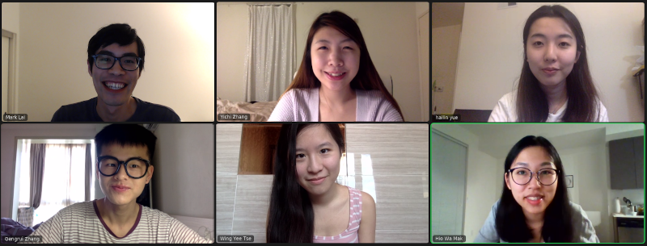

```{r setup, include=FALSE}
knitr::opts_chunk$set(echo = FALSE)
```

Hello! Welcome to MMM Lab in the Department of Psychology at the University of Southern California (USC). We develop and evaluate methods in Measurement and Multilevel Modeling. Measurement is the foundation of quantitative science, and it's especially important in psychological and social sciences as data in psychology is usually noisy and not perfectly reliable. Multilevel modeling is an extremely powerful framework with very broad applications for quantitative science. 

Check out our [Research](research.html) page for specific projects. We do statistical derivation, Monte Carlo simulations, and innovative applications of cutting-edge methods. We mainly use R, but currently we're also learning [Julia](https://julialang.org/). 

Interested in collaboration or have any questions? Feel free to email us.  
  

MMM Lab meeting during #quarantine
