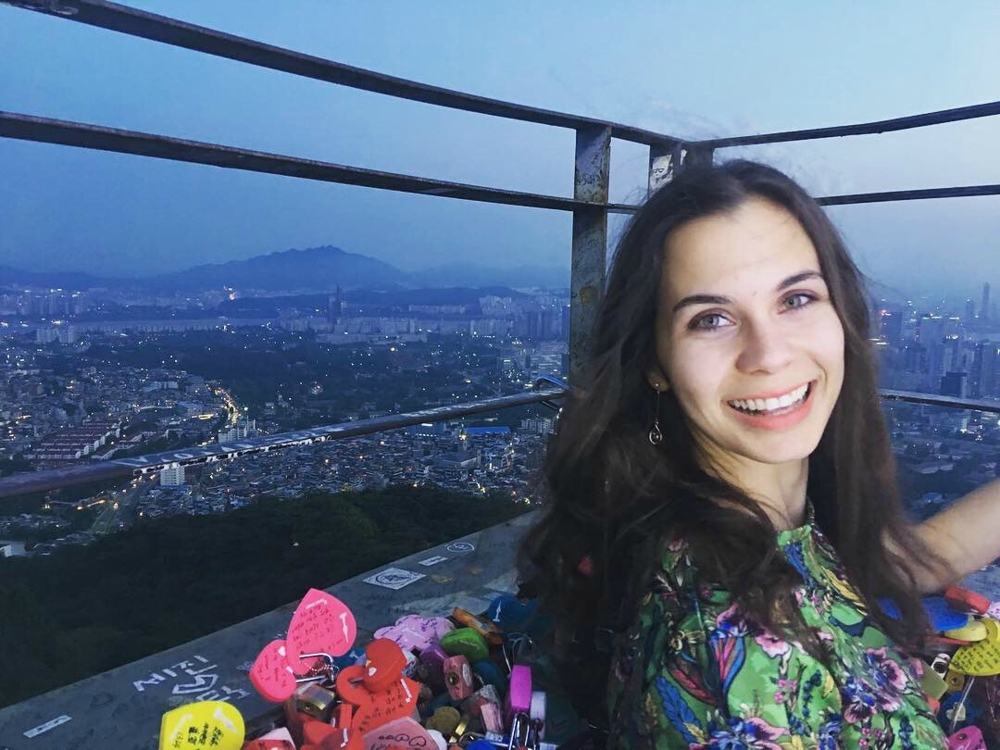

```{r setup, include=FALSE}
knitr::opts_chunk$set(echo = FALSE, 
                      out.width = "250px")
```

```{r}
paths <- c('static/images/slickr_files/MidAutumnPicnic21.jpg',
           'static/images/slickr_files/PointDumeHike21_1.jpg',
          'static/images/slickr_files/ThanksgivingPicnic21.jpg',
          'static/images/slickr_files/FirstLabMeetingofFall21.jpg',
          'static/images/slickr_files/PointDumeHike21_2.jpg',
          'static/images/slickr_files/Summer21.jpg')
alt_text <- c('Mid-Autumn Picnic 2021',
              'Point Dume Hike 2021-1', 
              'Thanksgiving picnic 2021',
              'FirstLabMeetingofFall2021', 
              'Point Dume Hike 2021-2', 
              'Summer21')
img_h <- 400
paths_w_alt_text <- mapply(function(x,txt,h){
  htmltools::tags$img(src = x, title = txt, height=h)},
  x = paths, txt = alt_text, h=img_h, SIMPLIFY = FALSE)
slickR::slickR(obj = paths_w_alt_text, height = 400) + slickR::settings(autoplay = TRUE, autoplaySpeed = 4000)
```

## Principal Investigator

### Hok Chio (Mark) Lai

```{r}
knitr::include_graphics("https://quantscience.rbind.io/author/hok-chio-mark-lai-%E9%BB%8E%E5%AD%B8%E6%98%AD/avatar_hu5fee5d8532847d51fbb6966683aaaac0_71984_270x270_fill_q90_lanczos_center.jpg")
```

I am an Assistant Professor of Psychology (Quantitative Methods) in the Department of Psychology at the University of Southern California. I am from Macau and speaks Cantonese as my native language. Mathematics has always been a favorite subject to me, but my growing interest in understanding the human mind lead me to pursue a bachelor degree in Psychology at the University of Macau, where I discovered that a career of developing and applying quantitative methods in the social sciences would be a very good fit to me.

I am interested in all kinds of statistical methods, but currently my research areas include multilevel modeling, structural equation modeling, effect size statistics, and measurement invariance. I also have collaborations on projects studying the prevalence, antecedents and consequences of gambling disorder, and in other areas such as evolutionary psychology, social psychology, developmental sciences, health sciences, etc.

- [CV](https://quantscience.rbind.io/files/Vita_Lai.pdf)
- [Personal website](https://quantscience.rbind.io)
- Email: hokchiol@usc.edu

## Graduate Students

### Winnie Wing-Yee Tse

```{r}
knitr::include_graphics("https://dornsife.usc.edu/assets/img/content/284548/wizard/xizebuje.jpg")
```

I am a third-year Ph.D. quantitative psychology student, working under the supervision of Dr. Hok Chio (Mark) Lai. Broadly speaking, my research interests are on multilevel modeling, structural equation modeling, and Bayesian statistics. My main project focuses on incorporating uncertainty in parameter values (e.g., effect size and intraclass correlation) for designing multilevel studies. My secondary project investigates when strict factorial invariance is a necessary condition for valid use of observed scale scores. I am also involved in projects on latent class/profile analysis, two-stage path analysis with adjustment for measurement noninvariance and unreliability, and multilevel regression and poststratification on subnational predictions with language data.

- [CV](static/cv/WinnieTse_CV_20220222.pdf)
- [Personal website](https://winniewytse.rbind.io/)
- Email: wingyeet@usc.edu

### Yichi Zhang

{width=50%}

Hello! I am a third-year Ph.D. student in quantitative psychology. I am co-advised by Dr. Hok Chio (Mark) Lai and Dr. Rand Wilcox. My current research interests are measurement invariance, robust structural equation modeling and longitudinal growth modeling. My current project is about establishing measurement invariance using a Bayesian ROME (region of measurement equivalence) method.

- [CV](static/cv/YichiZhang_CV_20220206.pdf)
- Email: yzhang97@usc.edu

### Jimmy Zhang

```{r}
knitr::include_graphics("https://dornsife.usc.edu/assets/img/content/284548/wizard/nojaqado.jpg")
```

Research Interests: Factor Analysis, Measurement Invariance, Meta-analysis

- Email: gengruiz@usc.edu

### Meltem Ozcan

{width=50%}

I am a first-year Ph.D. student in quantitative psychology at USC advised by Dr. Hok Chio (Mark) Lai. Broadly, I am interested in the development and application of advanced quantitative methods to assess and model dynamic and complex psychological phenomena, and more specifically, my research interests include measurement bias, Bayesian statistics, and psychometrics. At UC Santa Cruz, where I completed my M.S. in statistics, my research looked at the performance of the cumulative sum test for determining changepoints in time series under various correlation structures through a series of simulation experiments. Previously, I conducted research on an eclectic set of topics I find fascinating, including self-disclosure, intimacy, (skipping the) small talk, influence attempts in friendships on topics such as politics, linguistic patterns in trauma narratives, and light therapy for PTSD. I enjoy hiking, road trips, horror movies, reading, learning languages (Korean or Python), writing (stories or code), and skipping the small talk.

- Email: ozcan@usc.edu
- Personal website: https://www.linkedin.com/in/meltemozcan/ 

***

## Undergraduate Students

### Hailin Yue (Haley)

I am a fourth-year undergraduate student majoring in economics, with a minor in psychology and data analytics. I am interested in applying quantitative reasoning to study mental health and to optimize business decision I hope to pursue a graduate degree after graduation, but am not sure on what subject yet. Outside of academia, I enjoy reading, painting, listening to music, and watching TV dramas.

- Email: hailinyu@usc.edu


### Clay Cantrell

I am a fourth year undergraduate student studying Cognitive Science with a minor in Computer Programming at USC. My academic interests include computer-human interaction and social learning. When I'm not in front of a computer my hobbies include mountain bike riding, backpacking, and getting some fresh air.
 
- Email: cacantre@usc.edu

### Alyssa Delarosa

- Email: alyssad1@usc.edu


## Collaborators

[Hio Wa (Grace) Mak (U Southern Califnoria)](https://hiowamak.weebly.com/)

[George Richardson (U Cincinnati)](https://researchdirectory.uc.edu/p/richargg)

[Yu-Yu Hsiao (U New Mexico)](#)

## Lab Alumni

### Yuting Wang
