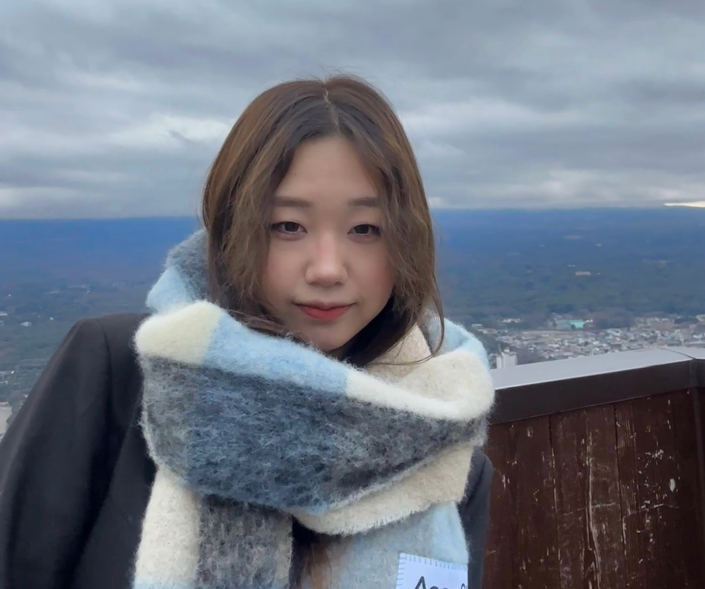
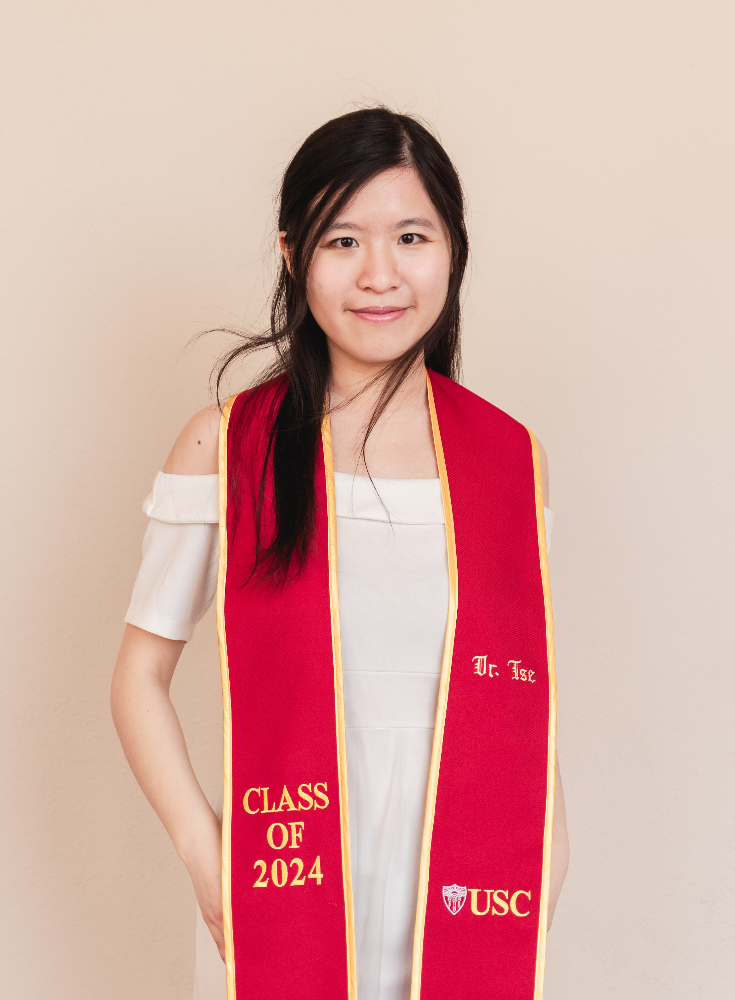

```{r setup, include=FALSE}
knitr::opts_chunk$set(echo = FALSE, 
                      out.width = "250px")
```

```{r photo slideshow}
library(htmltools)
library(slickR)

img_path <- "static/images/slickr_files/"

# generate paths with alt text and descriptions
paths_w_alt_text <- lapply(
  dir(img_path, full.names = TRUE),
  function(x) {
    htmltools::tags$img(src = x,
      title = tools::file_path_sans_ext(basename(x)),
      height = 400)
  }
)

# slideshow
slickR::slickR(obj = paths_w_alt_text, height = 400) +
  slickR::settings(autoplay = TRUE, autoplaySpeed = 4000)
```

## Principal Investigator

### Hok Chio (Mark) Lai

```{r}
knitr::include_graphics("https://dornsife.usc.edu/wp-content/uploads/2023/04/photo_1085621-900x1260.jpg")
```

I am an Associate Professor of Psychology (Quantitative Methods and Computational Psychology) in the Department of Psychology at the University of Southern California. I am from Macau and speaks Cantonese as my native language. Mathematics has always been a favorite subject to me, but my growing interest in understanding the human mind lead me to pursue a bachelor degree in Psychology at the University of Macau, where I discovered that a career of developing and applying quantitative methods in the social sciences would be a very good fit to me.

I am interested in all kinds of statistical methods, but currently my research areas include multilevel modeling, structural equation modeling, effect size statistics, and measurement invariance. I also have collaborations on projects studying the prevalence, antecedents and consequences of gambling disorder, and in other areas such as evolutionary psychology, social psychology, developmental sciences, health sciences, etc.

-   [CV](https://quantscience.rbind.io/files/Vita_Lai.pdf)
-   [Personal website](https://quantscience.rbind.io)
-   Email: [hokchiol\@usc.edu](mailto:hokchiol@usc.edu){.email}

## Graduate Students

### Jimmy Zhang

```{r}
knitr::include_graphics("https://dornsife.usc.edu/psyc/wp-content/uploads/sites/81/2023/03/gz.jpeg")
```

I am a fifth-year Ph.D. student in Quantitative Methods and Computational Psychology (QMCP) area at USC. My advisor is Dr. Hok Chio (Mark) Lai. I'm generally interested in how researchers can meta-analytic techniques to synthesize research information from their areas of interests and figure out broad and overarching effects. Specifically, researchers look into questions cross-sectionally and longitudinally with complex hypotheses formalized through various statistical models. For example, I'm interested in how structural equation modeling (SEM), longitudinal models, and moderation models can be applied in meta-analysis to synthesize the effects from different angles. My main project focuses on a meta-analysis of measurement invariance of the CES-D scale across gender groups.

-   Email: [gengruiz\@usc.edu](mailto:gengruiz@usc.edu){.email}

### Meltem Ozcan

{width="50%"}

I am a fourth-year Ph.D. student in quantitative psychology at USC advised by Dr. Hok Chio (Mark) Lai. Broadly, I am interested in developing and applying advanced quantitative methods to assess and model dynamic and complex psychological phenomena, and harnessing advances in machine learning and Bayesian statistics to improve upon traditional methods in psychology. My research interests include measurement invariance, fairness and accuracy in psychometric tests, Bayesian statistical methods, effect size statistics, and multilevel modeling. At UC Santa Cruz, where I completed my M.S. in statistics, I investigated the performance of changepoint detection techniques for time series under various correlation structures. Previously, I conducted research on an eclectic set of topics I find fascinating, including self-disclosure, intimacy, (skipping the) small talk, influence attempts in friendships on topics like politics, and linguistic patterns in trauma narratives. I enjoy learning languages (Korean or Python), writing (stories or code), and skipping the small talk.

-   Email: [ozcan\@usc.edu](mailto:ozcan@usc.edu){.email}
-   Personal website: <https://www.linkedin.com/in/meltemozcan/>
-   Github: <https://github.com/meltemozcan>

------------------------------------------------------------------------

## Undergraduate Students

### Alex Miles

I am currently a fourth-year undergraduate student majoring in psychology with a minor in statistics. I've always been interested in quantitative analysis and data science, and enjoy working on different analyses at the MMM Lab. In my free time, I enjoy reading science fiction, playing boardgames, and hanging out with friends!

### Nellie (Yinuo) Chen

{width="50%"}

I'm currently a third-year undergraduate student majoring in Psychology and Economics & Data Science. As the website maintainer of the MMM lab, I was offered great opportunities to be familiar with R Studio and Github. During my spare time, I enjoy dancing, reading, and singing Chinese traditional dramas.

-   Email: [yinuoche\@usc.edu](mailto:yinuoche@usc.edu){.email}

## Collaborators

[Hio Wa (Grace) Mak (U Southern Califnoria)](https://hiowamak.weebly.com/)

[George Richardson (U Cincinnati)](https://researchdirectory.uc.edu/p/richargg)

[Yu-Yu Hsiao (U New Mexico)](#)

## Lab Alumni

### Graduates

#### Winnie Wing-Yee Tse, Ph.D.

{width="50%"}

I am a psychometrician at Vretta, Inc., a Canadian educational technology company that partners with the Ministry of Education across provinces on K-12 and post-secondary assessments. I graduated from the Quantitative Methods and Computational Psychology program at USC in 2024. Broadly speaking, my research interests are in measurement, multilevel modeling, structural equation modeling, Bayesian statistics, and automated scoring.

<!-- I am a fifth-year Ph.D. quantitative psychology student, working under the supervision of Dr. Hok Chio (Mark) Lai. Broadly speaking, my research interests are in measurement, multilevel modeling, structural equation modeling, and Bayesian statistics. My primary research area centers on incorporating uncertainty in parameter values (e.g., effect size and intraclass correlation) for designing multilevel studies. My secondary research direction focuses on topics related to measurement and latent variable modeling, such as determining the necessary measurement conditions for valid group comparisons in observed and factor means and developing a two-stage approach that adjusts for measurement bias and unreliability in modeling relationships among latent variables.

- [CV](https://winniewytse.rbind.io/cv/winniewytse_cv.pdf) -->
- [Personal website](https://winniewytse.rbind.io/)
<!-- - Email: [wingyeet\@usc.edu](mailto:wingyeet@usc.edu){.email} -->

#### Yichi Zhang, Ph.D.

{width="50%"}

<!-- I am a fifth-year Ph.D. student in Quantitative Methods and Computational Psychology. I am co-advised by Dr. Hok Chio (Mark) Lai and Dr. Rand Wilcox. My current research interests are measurement bias in surveys/questionnaires and robust statistical models, such as hierarchical linear model(linear mixed effects model), latent variable model (structural equation modeling), etc. I hope to use psychometric methods and statistical models to explore research questions related to fair and accurate psychological measurement. My main project focuses on quantifying the practical impact of item bias(noninvariance) on total scale scores. My secondary project evaluates the impact of two-level heteroscedasticity on small sample corrections for fixed-effects inferences. In addition, I am involved in projects on bootstrapping for multilevel models, multilevel regression and poststratification on subnational predictions with language data.

- [CV](static/cv/Yichi.Zhang.CV.20231107.pdf) -->
<!-- - Email: [yzhang97\@usc.edu](mailto:yzhang97@usc.edu){.email} -->
- Personal website: <https://yichiyczhang.rbind.io/about.html>

### Undergraduates

#### Yuting Wang

#### Hailin Yue (Haley)

-   [Linkedin page](https://www.linkedin.com/in/hailin-haley-yue-65535219b/)

#### Clay Cantrell

-   [Linkedin page](https://www.linkedin.com/in/clay-cantrell-808676202/)

#### Alyssa Delarosa

-   [Linkedin page](https://www.linkedin.com/in/alyssa-delarosa-49272b163/)

#### Yixiao Li

<!-- I am currently a forth-year undergraduate student majoring in computer science. Personally, I am interested in quantitative analysis and data science, and am passionate about applying statistical methods in solving real-life problems. Previously, at MMM Lab, I have worked on projects including building R software package for a 2SPA model. Additionally, I love skateboard, basketball (I've played for several years), hang out with friends, and travel.

-   Email: [likather\@usc.edu](mailto:likather@usc.edu){.email} -->

#### Kezia Leung

<!-- I am a third-year undergraduate student majoring in Cognitive Science with a minor in Computer Programming. I'm very interested in user experience and using quantitative data to better understand the way we think in order to improve products. I want to apply quantitative methods to understand the human mind more. In my free time, I enjoy cooking, drawing, going to beaches, exploring the city, and eating food!

-   Email: [keleung\@usc.edu](mailto:keleung@usc.edu){.email} -->
